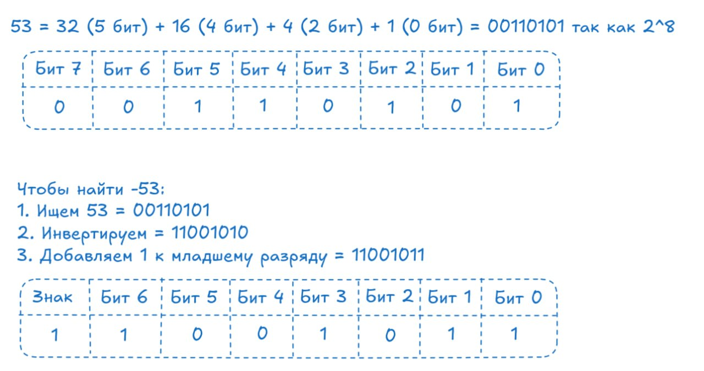
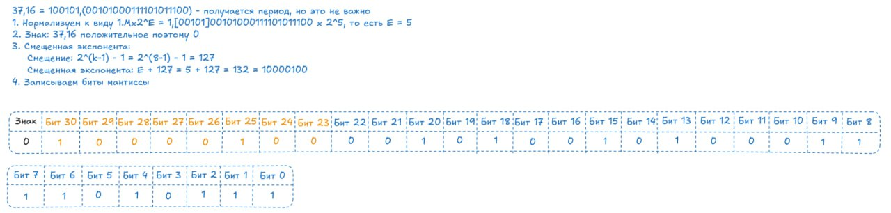

# 🔢 Типы в Go

Представь, что ты строишь дом из кубиков LEGO. У тебя есть кубики разных размеров и цветов. Каждый тип кубика подходит для своей задачи: большие для фундамента, маленькие для деталей, специальные для окон.

**Типы в Go** — это такие же кубики. Каждый тип говорит компилятору: «это число», «это текст», «это да/нет». От типа зависит, сколько памяти выделить и какие операции разрешены.

В Go строгая типизация. Нельзя сложить число и строку. Нельзя присвоить `int32` переменной типа `int64` без явного преобразования. Это не ограничение — это защита от ошибок.

---

## 📊 Классификация типов

Все типы в Go делятся на несколько категорий:

```
┌─────────────────────────────────────────────────────────────┐
│  Типы в Go                                                  │
├─────────────────────────────────────────────────────────────┤
│                                                             │
│  Базовые:                                                   │
│  • Числа (целые, с плавающей точкой, комплексные)           │
│  • Строки                                                   │
│  • Булевы                                                   │
│  • Операции с типами (преобразование, assertion, switch)    │
│                                                             │
│  Составные:                                                 │
│  • Массивы, слайсы, мапы                                    │
│                                                             │
│  Структуры (отдельная глава):                               │
│  • struct, методы, выравнивание                             │
│                                                             │
│  Специальные:                                               │
│  • Указатели, каналы, функции, интерфейсы                   │
│                                                             │
└─────────────────────────────────────────────────────────────┘
```

---

## 🔣 Целые числа


Целые числа в Go бывают **знаковые** (могут быть отрицательными) и **беззнаковые** (только неотрицательные).

### Как хранятся целые числа



**Данный подход использутся, потому что:**

- Сложение работает одинаково для положительных и отрицательных
- Нет двух нулей (+0 и -0)
- Аппаратно эффективно

**Беззнаковые числа** хранятся напрямую:

```
┌─────────────────────────────────────────────────────────────┐
│  uint8: 8 бит (1 байт)                                      │
│                                                             │
│  0 = 0000 0000                                              │
│  127 = 0111 1111                                            │
│  255 = 1111 1111 (максимальное значение)                    │
│                                                             │
│  Все биты используются для значения                         │
└─────────────────────────────────────────────────────────────┘
```

### Знаковые целые

| Тип | Размер | Диапазон |
|-----|--------|----------|
| `int8` | 1 байт | -128 до 127 |
| `int16` | 2 байта | -32,768 до 32,767 |
| `int32` | 4 байта | -2³¹ до 2³¹-1 |
| `int64` | 8 байт | -2⁶³ до 2⁶³-1 |
| `int` | 4 или 8 байт | Зависит от архитектуры |

```go
var a int8 = 100
var b int16 = -1000
var c int = 42  // размер зависит от платформы
```

**`int`** — тип по умолчанию. Используй его, если не знаешь, какой размер нужен.

### Беззнаковые целые

| Тип | Размер | Диапазон |
|-----|--------|----------|
| `uint8` | 1 байт | 0 до 255 |
| `uint16` | 2 байта | 0 до 65,535 |
| `uint32` | 4 байта | 0 до 2³²-1 |
| `uint64` | 8 байт | 0 до 2⁶⁴-1 |
| `uint` | 4 или 8 байт | Зависит от архитектуры |
| `uintptr` | - | Беззнаковое целое для хранения указателя |

```go
var port uint16 = 8080
var count uint = 100
```

**Когда использовать беззнаковые:**

- Индексы в массивах и слайсах
- Битовые флаги
- Хэш-коды
- Размеры в байтах

**Предостережение:** вычитание беззнаковых чисел может дать неожиданный результат:

```go
var a uint8 = 5
var b uint8 = 10
c := a - b  // 251, а не -5! (переполнение)
```

### Алиасы: byte и rune

**`byte`** — это алиас для `uint8`:

```go
var b byte = 'A'  // то же самое, что uint8
```

Используй `byte` для работы с байтами, а не `uint8`.

**`rune`** — это алиас для `int32`. Используется для символов Unicode:

```go
var r rune = '∑'  // символ суммы (код U+2211)
```

---

## 🔢 Числа с плавающей точкой

Для дробных чисел в Go есть два типа:

| Тип | Размер | Точность |
|-----|--------|----------|
| `float32` | 4 байта | ~7 десятичных знаков |
| `float64` | 8 байт | ~15 десятичных знаков |

```go
var price float64 = 19.99
var pi float32 = 3.14159
```

**`float64`** — тип по умолчанию. Используй его, если не знаешь, какая точность нужна.

### Как хранятся вещественные числа



Для представления вещественных чисел (очень больших или очень маленьких) используется **экспоненциальная форма**:

```
N = m × q^p

где:
  m — мантисса (значимость)
  q — основание системы (2 для двоичной)
  p — экспонента (порядок)
```

Это описано в международном стандарте [**IEEE 754**](https://en.wikipedia.org/wiki/IEEE_754):

1. **Знак (1 бит)** — 0 для положительных, 1 для отрицательных
2. **Экспонента** — отвечает за диапазон числа. Хранится со смещением:
   - float32: смещение 127 (реальная экспонента = хранится - 127)
   - float64: смещение 1023 (реальная экспонента = хранится - 1023)
3. **Мантисса** — отвечает за точность числа

**Важная особенность:** в нормализованных числах старший бит мантиссы (целая часть '1.') всегда равен 1 и **не хранится в памяти** (implicit bit). Это позволяет сэкономить один бит и увеличить точность.

**Специальные значения:**

```
┌─────────────────────────────────────────────────────────────┐
│  Специальные значения IEEE 754                              │
│                                                             │
│  +0 = 0 00000000 00000000000000000000000                    │
│  -0 = 1 00000000 00000000000000000000000                    │
│                                                             │
│  +∞ = 0 11111111 00000000000000000000000                    │
│  -∞ = 1 11111111 00000000000000000000000                    │
│                                                             │
│  NaN = * 11111111 10000000000000000000000                   │
│        (любой знак, экспонента все 1, мантисса ≠ 0)         │
└─────────────────────────────────────────────────────────────┘
```

### Специальные значения

```go
import "math"

var inf = math.Inf(1)   // положительная бесконечность
var neginf = math.Inf(-1)  // отрицательная бесконечность
var nan = math.NaN()    // Not a Number
```

**Важно:** сравнение с `NaN` всегда ложно:

```go
fmt.Println(math.NaN() == math.NaN())  // false
```

Для проверки используй `math.IsNaN()`:

```go
if math.IsNaN(x) {
    fmt.Println("Это NaN")
}
```

### Проблемы с плавающей точкой

```go
fmt.Println(0.1 + 0.2)  // 0.30000000000000004, а не 0.3!
```

Это не ошибка Go — это ограничение представления чисел с плавающей точкой в двоичной системе.

**Для денег используй `decimal` библиотеки или целые числа (копейки):**

```go
// ❌ Плохо для денег
var price float64 = 19.99

// ✅ Лучше: целые числа (копейки)
var priceCents int64 = 1999  // 19.99 в копейках

// ✅ Лучше: decimal библиотека
import "github.com/shopspring/decimal"

var price decimal.Decimal = decimal.NewFromFloat(19.99)
var total = price.Mul(decimal.NewFromInt(3))  // точное умножение
```

---

## 🔬 Комплексные числа

Go поддерживает комплексные числа «из коробки»:

| Тип | Описание |
|-----|----------|
| `complex64` | `float32` + `float32` |
| `complex128` | `float64` + `float64` |

```go
var c1 complex64 = 3 + 4i
var c2 complex128 = complex(3, 4)  // то же самое

fmt.Println(real(c1))  // 3.0
fmt.Println(imag(c1))  // 4.0
```

**На практике** используются редко, в основном в научных вычислениях.

---

## 📝 Строки

**Строка** в Go — это неизменяемая последовательность байтов.

```go
var s string = "Hello, 世界"
```

> **Примечание:** В этом разделе описывается **тип `string`** и его устройство.
> Функции для работы со строками (`strings.Split`, `strings.Join`, `strings.Builder` и др.)
> разбираются в главе [`stdlib/strings.md`](../stdlib/strings.md).

### Как хранится текст

Текст в компьютере — это последовательность числовых кодов, где каждому символу соответствует конкретный двоичный код.

**Стандарты кодирования:**

| Стандарт | Размер символа | Описание |
|----------|---------------|----------|
| ASCII | 7/8 бит | Базовый американский стандарт. Кодирует латиницу, цифры и управляющие символы (0-127) |
| CP866 | 8 бит | Кодовая страница MS-DOS для кириллицы |
| CP1251 | 8 бит | Кодировка Windows для кириллицы |
| UTF-8 | 1-4 байта | Универсальный стандарт (используется в Go) |

**UTF-8** — современный стандарт с переменной длиной:

1. Символы ASCII кодируются **одним байтом** (обратная совместимость)
2. Символы кириллицы и большинство европейских — **двумя байтами**
3. Иероглифы — **тремя и более байтами**

Это экономит место для английских текстов и обеспечивает полную поддержку многоязычности.

### Важные особенности

**1. Неизменяемость:**

```go
s := "hello"
// s[0] = 'H'  // ❌ ошибка: cannot assign to s[0]
```

**2. Длина в байтах, а не в рунах:**

```go
s := "привет"
fmt.Println(len(s))  // 12 байт (6 символов × 2 байта в UTF-8)
```

**Важно:** `len(s)` возвращает длину **данных** в байтах, а не размер типа:

```go
s := "привет"

len(s)              // 12 — длина данных (байты UTF-8)
unsafe.Sizeof(s)    // 16 — размер типа или же заголовка (ptr 8 + len 8)
```

```
┌─────────────────────────────────────────────────────────────┐
│  Структура string (16 байт на amd64)                        │
│                                                             │
│  Заголовок string:                                          │
│  ┌──────────────┬──────────────┐                            │
│  │  ptr (8)     │  len (8)     │                            │
│  │  → данные    │  12          │                            │
│  └──────────────┴──────────────┘                            │
│       ↓                                                     │
│  Данные (12 байт для "привет"):                             │
│  ┌────┬────┬────┬────┬────┬────┐                            │
│  │ п  │ р  │ и  │ в  │ е  │ т  │                            │
│  │ 2б │ 2б │ 2б │ 2б │ 2б │ 2б │                            │
│  └────┴────┴────┴────┴────┴────┘                            │
└─────────────────────────────────────────────────────────────┘
```

**3. Двойные кавычки:**

```go
s1 := "hello"        // интерпретирует \n, \t и т.д.
s2 := `hello\nworld` // сырая строка, \n как текст
```

### Работа со строками

```go
// Конкатенация
s := "hello" + " " + "world"

// Индексация (по байтам!)
s := "hello"
fmt.Println(s[0])  // 104 (байт 'h')

// Срез (по байтам!)
fmt.Println(s[0:2])  // "he"

// Преобразование
b := []byte(s)       // строка → байты
s = string(b)        // байты → строка
```

**Для работы с Unicode используй `rune`:**

```go
s := "привет"
runes := []rune(s)  // теперь каждый элемент — символ
fmt.Println(len(runes))  // 6
fmt.Println(runes[0])    // 1087 (код 'п')
```

---

## 🔥 Важные нюансы строк

### 1. Сравнение строк

**Оператор `==`** сравнивает содержимое строк:

```go
s1 := "hello"
s2 := "hello"
fmt.Println(s1 == s2)  // true
```

**Регистрозависимое сравнение:**

```go
s1 := "Hello"
s2 := "hello"
fmt.Println(s1 == s2)  // false
```

**Регистронезависимое сравнение:**

```go
import "strings"

s1 := "Hello"
s2 := "hello"
fmt.Println(strings.EqualFold(s1, s2))  // true
```

### 2. Пустая строка vs nil

**В Go нет `nil` строк:**

```go
var s string  // "" (пустая строка, не nil!)

fmt.Println(s == "")      // true
fmt.Println(s == nil)     // ошибка: s не может быть nil
fmt.Println(len(s))       // 0
```

**Проверка на пустоту:**

```go
// ✅ Правильно
if s == "" {
    // пустая строка
}

// ✅ Или по длине
if len(s) == 0 {
    // пустая строка
}
```

### 3. Эффективная конкатенация

**`+` для строк создаёт новую строку каждый раз:**

```go
// ❌ Неэффективно для больших строк
s := ""
for i := 0; i < 1000; i++ {
    s += strconv.Itoa(i)  // копия всей строки каждый раз!
}
```

**`strings.Builder` — эффективно:**

```go
// ✅ Эффективно
var b strings.Builder
for i := 0; i < 1000; i++ {
    b.WriteString(strconv.Itoa(i))
}
s := b.String()
```

**`strings.Join` для слайса строк:**

```go
// ✅ Лучше для слайса
parts := []string{"a", "b", "c"}
s := strings.Join(parts, ", ")  // "a, b, c"
```

### 4. Срез строки не копирует данные

**При срезе строки данные не копируются — создаётся новый заголовок, который указывает на те же байты:**

```go
s := "hello world"
sub := s[0:5]  // "hello"
```

```
┌─────────────────────────────────────────────────────────────┐
│  Срез строки не копирует данные                             │
│                                                             │
│  Исходная строка s = "hello world":                         │
│  ┌──────────────┬──────────────┐                            │
│  │  ptr ────────┼──→ данные    │                            │
│  │  len = 11    │  "hello world"                            │
│  └──────────────┴──────────────┘                            │
│                                                             │
│  Срез sub = s[0:5]:                                         │
│  ┌──────────────┬──────────────┐                            │
│  │  ptr ────────┼─→ данные     │                            │
│  │  len = 5     │  "hello"     │  ← те же данные!           │
│  └──────────────┴──────────────┘                            │
│                            ↑                                │
│                            │                                │
│  sub.ptr указывает на начало s.ptr                          │
└─────────────────────────────────────────────────────────────┘
```

**Проблема:** если оригинальная строка большая, а срез маленький, GC не может освободить память оригинала, пока жив срез:

```go
// Пример: s = 10 MB, sub = 5 байт
func extractFirstLine(hugeString string) string {
    lines := strings.Split(hugeString, "\n")
    return lines[0]  // lines[0] держит в памяти весь hugeString!
}

// Вызов:
book := loadBook()      // 10 MB
firstLine := extractFirstLine(book)  // вернёт ~50 байт

// В памяти всё ещё 10 MB, хотя нужна только первая строка!
```

```
┌─────────────────────────────────────────────────────────────┐
│  Проблема: срез держит память оригинала                     │
│                                                             │
│  hugeString (10 MB):                                        │
│  ┌──────────────┬──────────────┐                            │
│  │  ptr ────────┼──────────→ 10 MB данных                  │
│  │  len = 10MB  │  "Big book text..."                      │
│  └──────────────┴──────────────┘                            │
│                            ↑                                │
│                            │                                │
│  firstLine (50 байт):      │                                │
│  ┌──────────────┬──────────────┐                            │
│  │  ptr ────────┼──┘           │  ← указывает в hugeString │
│  │  len = 50    │  "Chapter 1" │                            │
│  └──────────────┴──────────────┘                            │
│                                                             │
│  GC не может освободить hugeString, пока жив firstLine!     │
└─────────────────────────────────────────────────────────────┘
```

**Решение:** копируй данные, если нужно освободить память:

```go
// strings.Clone (Go 1.18+) — выделяет новую память
sub := strings.Clone(s[0:5])

// Или через []byte — тоже копирует
sub = string([]byte(s[0:5]))
```

**Когда это важно:**

- Парсинг больших файлов (логи, JSON, XML)
- Извлечение маленьких подстрок из больших
- Долгоживущие подстроки (кэш, глобальные переменные)

### 5. Строки как ключи мапы

**Строки можно использовать как ключи мапы:**

```go
m := map[string]int{
    "one":   1,
    "two":   2,
    "three": 3,
}

fmt.Println(m["one"])  // 1
```

**Почему это работает:**

- Строки неизменяемые (immutable)
- Строки сравниваемые (comparable)
- Хэш строки вычисляется быстро

### 6. Проверка UTF-8

**`utf8.Valid` проверяет валидность UTF-8:**

```go
import "unicode/utf8"

data := []byte{0xff, 0xfe}  // невалидный UTF-8
fmt.Println(utf8.Valid(data))  // false

data = []byte("привет")
fmt.Println(utf8.Valid(data))  // true
```

### 7. String interning

**В Go нет автоматического string interning:**

```go
// Каждая строка — отдельный объект в памяти
s1 := "hello"
s2 := "hello"
// s1 и s2 могут указывать на разные данные
// (компилятор может оптимизировать строковые литералы)
```

**Для явного interning используй `map`:**

```go
type Interner struct {
    mu   sync.Mutex
    data map[string]string
}

func (i *Interner) Intern(s string) string {
    i.mu.Lock()
    defer i.mu.Unlock()
    
    if v, ok := i.data[s]; ok {
        return v  // возвращаем существующую
    }
    i.data[s] = s
    return s
}
```

---

## ✅ Булевы значения

**`bool`** принимает два значения: `true` или `false`.

```go
var done bool = false
var active = true  // тип выводится
```

### Операции

```go
a := true
b := false

fmt.Println(a && b)  // false (И)
fmt.Println(a || b)  // true (ИЛИ)
fmt.Println(!a)      // false (НЕ)
```

---

## 🔄 Преобразование типов (Type Conversion)

В Go **нет неявных преобразований** между типами. Даже между `int32` и `int64`.

### Явное преобразование

```go
var a int32 = 100
var b int64 = int64(a)  // явное преобразование

var c float64 = 3.14
var d int = int(c)  // 3 (дробная часть отбрасывается)
```

### Правила преобразования

**1. Числовые типы:**

```go
// int → int64
var a int = 100
var b int64 = int64(a)

// float64 → int (дробная часть отбрасывается)
var f float64 = 3.99
var i int = int(f)  // 3

// int → float64
var i int = 42
var f float64 = float64(i)  // 42.0
```

**2. Строки и байты:**

```go
// string → []byte
s := "hello"
b := []byte(s)

// []byte → string
b := []byte{104, 101, 108, 108, 111}
s := string(b)  // "hello"

// rune → string
r := 'A'
s := string(r)  // "A"

// string → rune slice (для Unicode)
s := "привет"
runes := []rune(s)  // каждый элемент — символ
```

**3. Указатели (unsafe):**

```go
import "unsafe"

var i int = 42
p := (*float64)(unsafe.Pointer(&i))  // опасно!
```

**⚠️ Важно:** преобразование между несовместимыми типами через `unsafe.Pointer` может привести к неопределённому поведению.

### Опасные преобразования

**Переполнение:**

```go
var a int32 = 1000
var b int8 = int8(a)  // -24 (переполнение!)

fmt.Printf("%d → %d\n", a, b)
```

**Потеря точности:**

```go
var f float64 = 3.999
var i int = int(f)  // 3 (не 4!)

// Для округления:
import "math"
var i int = int(math.Round(f))  // 4
```

**NaN и Inf:**

```go
import "math"

var f float64 = math.NaN()
var i int = int(f)  // 0 (специальное поведение)
```

### Когда преобразование необходимо

**1. Арифметика смешанных типов:**

```go
var a int32 = 10
var b int64 = 20

// var c int64 = a + b  // ошибка
var c int64 = int64(a) + b  // OK
```

**2. Деление:**

```go
var a int = 5
var b int = 2

var f float64 = float64(a) / float64(b)  // 2.5
```

**3. Индексы массивов:**

```go
var i int64 = 5
var slice []int

// slice[i] = 1  // ошибка
slice[int(i)] = 1  // OK
```

---

## ✅ Утверждение типа (Type Assertion)

**Утверждение типа** — это способ проверить конкретный тип интерфейсного значения.

```go
var i interface{} = "hello"

s := i.(string)  // утверждение: i имеет тип string
fmt.Println(s)   // "hello"
```

### Синтаксис

```go
value := interfaceValue.(Type)
```

Если `interfaceValue` не имеет типа `Type`, будет паника.

### Безопасное утверждение

Используй форму с двумя результатами:

```go
value, ok := interfaceValue.(Type)

if !ok {
    fmt.Println("Не тот тип")
}
```

**Пример:**

```go
var i interface{} = 42

n, ok := i.(int)
if ok {
    fmt.Println("Это int:", n)
}

s, ok := i.(string)
if !ok {
    fmt.Println("Это не string")
}
```

### Утверждение с интерфейсами

Можно утверждать не только конкретные типы, но и интерфейсы:

```go
type Reader interface {
    Read([]byte) (int, error)
}

var r io.Reader = getFileReader()

if reader, ok := r.(io.ReadWriter); ok {
    // r реализует ReadWriter
    reader.Write([]byte("hello"))
}
```

---

## 🎯 Переключатель типов (Type Switch)

**Переключатель типов** — это `switch`, который проверяет тип интерфейсного значения.

```go
func describe(i interface{}) {
    switch v := i.(type) {
    case int:
        fmt.Printf("Целое: %d\n", v)
    case string:
        fmt.Printf("Строка: %s\n", v)
    case bool:
        fmt.Printf("Булево: %v\n", v)
    default:
        fmt.Printf("Неизвестный тип: %T\n", v)
    }
}

describe(42)       // "Целое: 42"
describe("hello")  // "Строка: hello"
```

### Синтаксис

```go
switch v := interfaceValue.(type) {
case Type1:
    // v имеет тип Type1
case Type2:
    // v имеет тип Type2
default:
    // другой тип
}
```

**Важно:** внутри каждого `case` переменная `v` имеет соответствующий тип.

### Несколько типов в case

```go
switch v := i.(type) {
case int, int32, int64:
    fmt.Printf("Целое: %v\n", v)
case float32, float64:
    fmt.Printf("Дробное: %v\n", v)
}
```

### Переключатель без переменной

```go
switch i.(type) {
case int:
    fmt.Println("Целое")
case string:
    fmt.Println("Строка")
}
```

---

## 🏷️ Алиасы типов (Type Alias)

**Алиас** — это другое имя для существующего типа.

```go
type ByteSlice = []byte
type StringMap = map[string]string
```

### Когда использовать

**1. Упрощение сложных типов:**

```go
type HandlerFunc = func(http.ResponseWriter, *http.Request)

func handle(w http.ResponseWriter, r *http.Request) {
    // ...
}

var h HandlerFunc = handle
```

**2. Совместимость версий:**

```go
// В версии 1
type Context = context.Context

// Позже можно изменить на свой тип без поломки API
```

### Алиас vs новый тип

**Алиас (`=`):**

```go
type MyInt = int  // алиас

var a MyInt = 42
var b int = a  // OK, это тот же тип
```

**Новый тип (без `=`):**

```go
type MyInt int  // новый тип

var a MyInt = 42
// var b int = a  // ошибка, разные типы
var b int = int(a)  // нужно преобразование
```

**Новый тип может иметь методы:**

```go
type MyInt int

func (m MyInt) Double() MyInt {
    return m * 2
}

a := MyInt(5)
fmt.Println(a.Double())  // 10
```

---

## 🧬 Внутреннее устройство: как компилятор видит типы

В компиляторе Go каждый тип представлен интерфейсом `types.Type`:

```go
type Type interface {
    Kind() Kind        // категория типа
    String() string    // строковое представление
    Size() int64       // размер в байтах
    Align() int        // выравнивание
    IsComparable() bool  // можно ли сравнивать
    IsOrdered() bool     // можно ли применять < >
    
    // Для конкретных типов:
    *Basic    // int, string, bool
    *Pointer  // указатели
    *Slice    // слайсы
    *Map      // мапы
    *Struct   // структуры
    *Func     // функции
    *Interface // интерфейсы
}
```

### Basic: базовые типы

```go
type Basic struct {
    kind  BasicKind  // категория (Int, Uint, Float, String, Bool)
    info  BasicInfo  // флаги (IsSigned, IsUnsigned, IsFloat, etc.)
    name  string     // имя типа
}
```

**Пример:**

```go
// int в компиляторе
types.Typ[types.Int]  // *Basic{kind: Int, name: "int"}

// string
types.Typ[types.String]  // *Basic{kind: String, name: "string"}
```

### Size и Align: размер и выравнивание

**`Size()`** — размер типа в байтах:

```go
var x int32
unsafe.Sizeof(x)  // 4

var y int64
unsafe.Sizeof(y)  // 8

var s string
unsafe.Sizeof(s)  // 16 (ptr + len)
```

**`Align()`** — выравнивание в памяти:

Выравнивание в памяти важно, чтобы программа могла эффективно доставать данные.

```go
// На amd64:
unsafe.Alignof(int8(0))   // 1
unsafe.Alignof(int16(0))  // 2
unsafe.Alignof(int32(0))  // 4
unsafe.Alignof(int64(0))  // 8
unsafe.Alignof(string("")) // 8
```

---

## 🧩 Составные типы: слайсы и мапы

Представь, что ты собираешь конструктор. У тебя есть отдельные детали (базовые типы), но чтобы построить что-то полезное, нужно соединить их вместе.

В Go есть два основных составных типа для работы с коллекциями:

- **Слайс** — динамический массив (самый используемый)
- **Мапа** — ассоциативный массив (ключ → значение)

Массивы существуют, но используются редко. 

> **Примечание:** Подробное устройство слайсов и мапов разбирается в отдельных главах:
> - [`array-slices.md`](./array-slices.md) — массивы и слайсы
> - [`maps.md`](./maps.md) — мапы (Swiss Table)

---

## 🎯 Итог

**Базовые типы:**

- `int` — тип по умолчанию для целых чисел
- `float64` — тип по умолчанию для дробных
- `byte` = `uint8`, `rune` = `int32`
- `string` — неизменяемая последовательность байтов (UTF-8)
- Нет неявных преобразований между типами
- Type assertion: `value, ok := i.(Type)`
- Type switch: `switch v := i.(type)`

**Внутреннее устройство:**

- `types.Type` — интерфейс для всех типов
- `Size()`, `Align()` — размер и выравнивание
- Структуры: поля располагаются последовательно с выравниванием
- Методы: получатель `*T` изменяет оригинал, `T` — копию

**Избегай:**

- `float64` для денег
- Беззнаковых типов без необходимости
- Преобразований без проверки на переполнение
- Утверждений типа без проверки `ok`

Понимание типов и их внутреннего устройства — основа написания эффективного кода на Go.
