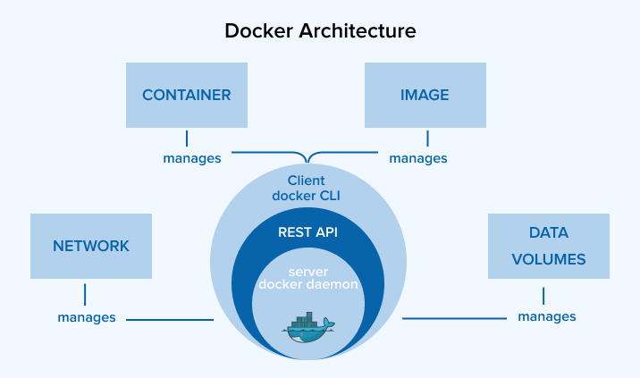

# 🏗️ Архитектура Docker

!!! abstract "💡 Тезис"

    Docker использует клиент-серверную архитектуру.

    Пользователь взаимодействует с **Docker CLI**, который отправляет команды **демону Docker (`dockerd`)**.

    Демон, в свою очередь, управляет объектами (контейнерами, образами, сетями, томами) и делегирует задачи по запуску контейнеров более низкоуровневым инструментам, таким как **`containerd`** и **`runc`**.



---

## 🧱 Ключевые компоненты

### 🖥️ Docker CLI

Интерфейс командной строки (CLI), через который пользователь взаимодействует с Docker.

!!! note "Принцип работы"

    CLI преобразует команды (`docker run`, `docker build`) в HTTP-запросы к Docker API и отправляет их демону `dockerd`.

!!! tip "Удаленное управление"

    Вы можете подключить локальный Docker CLI к демону на удаленной машине, указав его адрес в переменной окружения `DOCKER_HOST`.

    ```bash
    export DOCKER_HOST=tcp://192.168.1.100:2375
    ```

!!! info "Подробнее см. в главе 👉 [**Docker CLI**](./docker-cli.md)."

### 📦 Docker Daemon

Основной управляющий процесс (сервис), который слушает запросы по API и управляет объектами Docker.

!!! abstract "💡 Основные задачи `dockerd`"

    - **Управление объектами:** Создание, запуск, остановка и удаление контейнеров, образов, томов и сетей,
    - **API:** Предоставление REST API для взаимодействия с клиентами,
    - **Делегирование:** Передача задач по управлению жизненным циклом контейнеров демону `containerd`.

!!! example "Конфигурация демона"

    Настройки `dockerd` хранятся в файле `/etc/docker/daemon.json`.

    ```json
    {
      "storage-driver": "overlay2",
      "log-driver": "json-file",
      "iptables": true
    }
    ```

### ⚙️ Containerd

Высокоуровневый runtime, который управляет полным жизненным циклом контейнера.

!!! abstract "💡 Основные задачи `containerd`"

    - **Управление образами:** Загрузка, хранение и передача образов.
    - **Управление выполнением:** Создание, запуск и остановка контейнеров через `runc`.
    - **Управление снимками (snapshots):** Управление файловыми системами контейнеров.
    - **API:** Предоставление собственного gRPC API для `dockerd` и других клиентов (например, Kubernetes через CRI-плагин).

!!! note "Роль `containerd-shim`"

    `containerd` не запускает контейнеры напрямую.

    Для каждого контейнера он создает дочерний процесс-прокладку — **`containerd-shim`**. 
    Этот `shim` вызывает `runc` для создания контейнера, а затем продолжает работать, чтобы:

    - Сохранять открытыми потоки `STDIN`, `STDOUT`, `STDERR`,
    - Сообщать `containerd` о статусе выхода контейнера,
    - Позволить `runc` завершить свою работу после запуска контейнера.

!!! info "Расширяемость и конфигурация"

    - **Конфигурация:** `containerd` настраивается через файл `config.toml` (обычно в `/etc/containerd/config.toml`). Именно он подготавливает спецификацию `config.json` для `runc`.
    - **Плагины:** Архитектура `containerd` полностью основана на плагинах. Вы можете расширять его функциональность, создавая собственные плагины на Go.
    - **Документация:** Официальная документация доступна на *[containerd.io](https://containerd.io/)*.


### 🔧 Runc

Низкоуровневый runtime (OCI-совместимый), который отвечает непосредственно за создание и запуск контейнера.

!!! abstract "💡 Основные задачи `runc`"

    - **Создание изоляции:** Настройка `namespaces` и `cgroups`.
    - **Запуск процесса:** Запуск основного процесса внутри изолированной среды.
    - **Работа с `config.json`:** Применение конфигурации, подготовленной `containerd`.

!!! note "Ограниченная ответственность"

    `runc` ничего не знает об образах, сетях или томах.

    Его единственная задача — взять подготовленную файловую систему и конфигурационный файл и запустить процесс.

    После запуска `runc` завершает свою работу.

---

## 🚀 Жизненный цикл

Рассмотрим, что происходит при выполнении команды `docker run -d nginx`:

1.  **Docker CLI** отправляет API-запрос `POST /containers/create` и `POST /containers/start` демону `dockerd`.
2.  **`dockerd`** получает запрос, проверяет наличие образа `nginx`, при необходимости скачивает его и обращается к `containerd` через gRPC API для запуска контейнера.
3.  **`containerd`**:
    - Создает снимок (snapshot) файловой системы для контейнера из образа `nginx`.
    - Готовит конфигурацию контейнера (`config.json`).
    - Запускает процесс `containerd-shim` для будущего контейнера.
4.  **`containerd-shim`** вызывает `runc` с путем к `config.json`.
5.  **`runc`**:
    - Использует системные вызовы ядра Linux для создания `namespaces` и `cgroups`.
    - Запускает процесс `nginx` внутри изолированной среды.
    - Завершает свою работу.
6.  **`containerd-shim`** остается работать, управляя потоками ввода-вывода и отслеживая статус процесса `nginx`.

---

## 🧰 Экосистема Docker

Docker — это не просто runtime, а целая платформа. Вот ключевые компоненты его экосистемы:

### 🏗️ Сборка и образы

| Компонент | Назначение | Ссылка |
| :--- | :--- | :--- |
| **Dockerfile** | Описание процесса сборки образа через инструкции (`FROM`, `RUN`, `CMD` и др.) | [Подробнее](./dockerfile.md) |
| **BuildKit** | Расширенный движок сборки образов: кэш, secrets, многоплатформенность | [Подробнее](./buildkit.md) |
| **Файловая система** | Слои, overlay2, copy-on-write, оптимизация структуры образов | [Подробнее](./filesystem.md) |

### 🧱 Ресурсы

| Компонент | Назначение | Ссылка |
| :--- | :--- | :--- |
| **Volumes (Тома)** | Хранение данных вне контейнера, поддержка локальных и удалённых хранилищ | [Подробнее](./volumes.md) |
| **Networks (Сети)** | Изоляция и взаимодействие между контейнерами, поддержка CNI | [Подробнее](./networks.md) |
| **Logging Drivers** | Подключение систем логирования (json-file, syslog, ELK и др.) | [Подробнее](./logging.md) |

### ⚙️ Управление

| Компонент | Назначение | Ссылка |
| :--- | :--- | :--- |
| **Docker Compose** | Управление многоконтейнерными приложениями через `docker-compose.yml` | [Подробнее](./compose.md) |
| **Процессы** | Управление процессами внутри контейнера | [Подробнее](./processes.md) |

### 🧩 Расширения

| Компонент | Назначение | Ссылка |
| :--- | :--- | :--- |
| **Plugins** (Плагины) | Расширение функциональности через volume-, network- и auth-плагины | [Подробнее](./plugins.md) |
| **Registries** (Реестры) | Реестры образов: Docker Hub, Harbor, GitLab, RBAC, сканирование | [Подробнее](./registry.md) |

### 🔒 Безопасность

| Компонент | Назначение | Ссылка |
| :--- | :--- | :--- |
| **Безопасность** | Изоляция контейнеров (AppArmor, SELinux, seccomp) и проверка целостности образов (Docker Content Trust). | [Подробнее](./security.md) |
