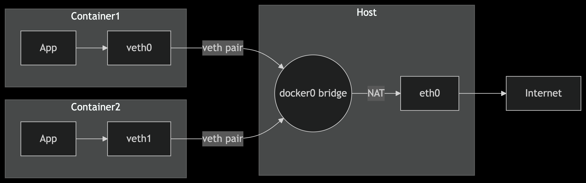
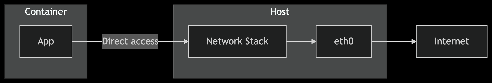
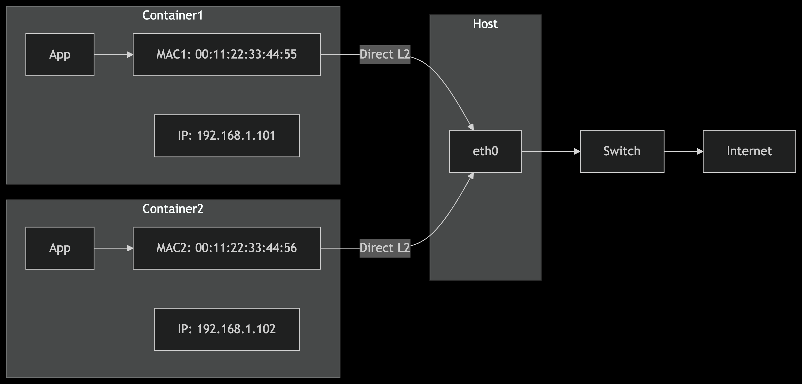

# 🌐 Сети в Docker

Сетевое взаимодействие — одна из ключевых составляющих при работе с контейнерами.

Изолированные по умолчанию, контейнеры должны иметь возможность общаться друг с другом и с внешним миром.

Docker предоставляет гибкую и мощную систему для управления сетями, однако для production-систем, особенно на базе Kubernetes, используются более продвинутые подходы.

!!! abstract "💡 Тезис"

    Современная работа с сетями в Docker строится на кастомных `bridge` сетях для изоляции и встроенном DNS для обнаружения сервисов на одном хосте.

    В multi-host окружениях (кластерах) стандарт де-факто — **Kubernetes** с CNI-плагинами (Calico, Cilium), которые обеспечивают производительность, безопасность и сетевые политики.

---

## ⚙️ Режимы сетевой среды

Docker предоставляет несколько драйверов, которые определяют, как контейнер будет взаимодействовать с сетью хоста и другими контейнерами.

| Характеристика | `bridge` (кастомная) | `host` | `macvlan` | `overlay` |
| :--- | :--- | :--- | :--- | :--- |
| **Область действия** | Один хост | Один хост | Один хост | Несколько хостов (кластер) |
| **Изоляция** | ✅ Высокая (межконтейнерная) | 🔻 Нет (контейнер использует сеть хоста) | ✅ Видим как отдельный хост в сети | ✅ Изолирует сервисы по overlay-сети |
| **DNS Discovery** | ✅ Есть (имена контейнеров) | ❌ Нет встроенного DNS | ❌ Нет встроенного DNS | ✅ Встроенный DNS между контейнерами в сети |
| **Доступ снаружи** | Через проброс портов (`-p`) | Автоматический (общая сеть с хостом) | Как полноценное сетевое устройство | Через ingress/внешние LB |
| **Производительность** | ✅ Хорошая | 🚀 Максимальная | ✅ Высокая (если правильно настроить) | 🔻 Зависит от наладки оверлея (обычно медленнее) |
| **Безопасность** | ✅ Хорошая | 🔻 Низкая (нет сетевой изоляции) | ✅ Высокая (можно ограничить MAC/IP) | ✅ Хорошая (в рамках кластера) |
| **Сложность настройки** | ✅ Простая | ✅ Простая | 🔺 Требует настройки VLAN/физического интерфейса | 🔺 Требует Swarm или других инструментов |
| **Основной сценарий** | Связь контейнеров одного приложения | Производительность-критичные задачи | Интеграция в существующие L2-сети | Микросервисные приложения в кластере |

### 📊 Схемы архитектур

!!! example "🌉 Bridge Mode"

    

!!! example "🏠 Host Mode"

    

!!! example "🔌 Macvlan Mode"

    

!!! warning "Использование `host` режима"

    Режим `host` полностью снимает сетевую изоляцию.

    Любой порт, открытый в контейнере, будет открыт на хосте.

    Этот режим полезен для приложений, которым нужен прямой доступ к сетевым интерфейсам хоста (например, VPN-клиенты или утилиты мониторинга), но он создает риски безопасности и может привести к конфликту портов.

!!! info "Особенности `macvlan`"

    - Требует Ethernet-интерфейса хоста в режиме `promiscuous`.
    **Не работает с Wi-Fi**, так как стандарт 802.11 не позволяет одному клиенту использовать несколько MAC-адресов.
    - **Контейнер с `macvlan` не сможет общаться с хостом напрямую** — это ограничение данной сетевой модели.

!!! example "⚙️ Пример создания `macvlan` сети"

    ```bash
    docker network create -d macvlan \
      --subnet=192.168.1.0/24 \
      --gateway=192.168.1.1 \
      -o parent=eth0 pub_net
    ```

---

## 🔗 Механизмы связи

| Характеристика | `--link` | **Services (Swarm)** | **Networks (кастомные)** |
| :--- | :--- | :--- | :--- |
| **Механизм** | Записи в `/etc/hosts` + переменные окружения | DNS + встроенный Load Balancer | Встроенный DNS и IP-адресация |
| **Поддержка DNS** | ❌ Нет | ✅ Да (внутри overlay сети) | ✅ Да (внутри custom `bridge` сети) |
| **Автоматическое обновление** | ❌ Нет — не реагирует на рестарт контейнеров | ✅ Да — автоматическая регистрация/удаление | ✅ Да — DNS-имена обновляются при перезапуске |
| **Изоляция сервисов** | 🔻 Нет | ✅ Да — по overlay-сетям | ✅ Да — по custom-сетям |
| **Совместимость с Compose** | ⚠️ Частичная | ✅ Полная (через `deploy`) | ✅ Полная |
| **Масштабирование** | ❌ Нет | ✅ Встроено в концепцию | ❌ Не встроено, но возможно вручную |
| **Управление состоянием** | ❌ Нет | ✅ Да (состояние кластера хранится) | ❌ Нет — Docker не отслеживает "сервисность" |
| **Актуальность** | ❌ Устарело (DEPRECATED) | ⚠️ Только в рамках Swarm (не для Kubernetes) | ✅ Современно, рекомендуется |
| **Основной сценарий** | Ранние версии Docker, примитивная связь | Распределенные сервисы в Swarm-кластере | Современные приложения на одном хосте или с proxy |

---

## 🧭 Service Discovery

В микросервисной архитектуре приложениям нужно автоматически находить друг друга.

Этот процесс называется **Service Discovery**.

### ⚙️ Встроенный DNS

Самый простой способ — использовать встроенный DNS-сервер, который работает в кастомных `bridge` сетях.

Docker автоматически присваивает контейнеру DNS-имя, совпадающее с его именем.

!!! example "⚙️ Пример работы встроенного DNS"

    1.  **Создаем сеть и контейнеры:**

        ```bash
        docker network create my-app-net
        docker run -d --name db --network my-app-net postgres:13
        docker run -d --name web --network my-app-net alpine sleep 3600
        ```

    2.  **Проверяем разрешение имен из контейнера `web`:**

        ```bash
        # Устанавливаем утилиты, если их нет в образе
        docker exec web apk add --no-cache curl bind-tools

        # Проверяем DNS-запись с помощью getent
        docker exec web getent hosts db
        # Ожидаемый вывод (IP-адрес может отличаться):
        # 172.19.0.2      db

        # Проверяем связь с помощью curl
        docker exec web curl http://db:5432
        # curl: (7) Failed to connect to db port 5432 after 0 ms: Connection refused
        ```

        Получение `Connection refused` означает, что DNS-имя успешно разрешилось, но порт на контейнере `db` отклоняет соединение (что нормально, так как PostgreSQL не обслуживает HTTP-запросы).

### 🛠️ Внешние инструменты

Для более сложных сценариев используются внешние инструменты.

-   **Key-Value хранилища (Consul, etcd)**: Сервисы при старте регистрируют себя в хранилище.
-   **Reverse Proxy (Traefik, NGINX)**: Прокси-серверы, которые автоматически отслеживают запуск и остановку контейнеров и обновляют свою конфигурацию маршрутизации.

!!! success "✅ Рекомендация: Traefik для Docker"

    **Traefik** — идеальный выбор для управления доступом к контейнерам на одном хосте.

    Он интегрируется с Docker API, отслеживает лейблы контейнеров и автоматически настраивает роутинг.

!!! info "DNS в Kubernetes: CoreDNS"

    В то время как встроенный DNS в Docker подходит для одного хоста, в кластерах Kubernetes эту роль выполняет **CoreDNS**.

    Он стал промышленным стандартом, заменив более ранние решения (например, `kube-dns` и `SkyDNS`), и обеспечивает гибкую и расширяемую систему обнаружения сервисов.

---

## 🔌 Сетевые плагины

!!! question "Зачем здесь CNI, если мы про Docker?"

    Хотя CNI-плагины вроде Calico и Cilium не работают с Docker напрямую, они упоминаются здесь по двум причинам:

    1.  Они используются в production-средах, куда обычно мигрируют после разработки в Docker.
    2.  Они демонстрируют, **какие сетевые возможности есть у Kubernetes, но недоступны в Docker**.

    Таким образом, понимание CNI важно для построения масштабируемой, безопасной сетевой архитектуры — даже если вы пока используете только Docker.

### 💥 Несовместимость

Важно понимать ключевое различие в сетевых моделях:

-   **Docker Engine** использует собственную библиотеку **`libnetwork`** для управления драйверами (`bridge`, `host` и др.).
-   **Kubernetes** использует стандарт **CNI (Container Network Interface)**, который поддерживается средами исполнения `containerd` и `CRI-O`.

!!! info "Контекст"

    Ни Calico, ни Cilium не работают с `docker engine` напрямую — они применяются в Kubernetes-кластерах.

    Но знание их принципов и возможностей полезно даже при проектировании локальных окружений, чтобы понимать, **где заканчиваются возможности Docker** и начинается потребность в полноценной сетевой архитектуре.

!!! question "А как же Docker Swarm?"

    Docker Swarm был встроенным оркестратором Docker, использующим `overlay` сети для связи контейнеров между хостами.

    Однако с 2020-х годов развитие Swarm фактически остановилось, и сообщество перешло на Kubernetes как более гибкое и мощное решение.

### ⚖️ Сравнение CNI

| Критерий | **Flannel** | **Calico** | **Cilium** |
| :--- | :--- | :--- | :--- |
| **Тип маршрутизации** | Overlay (VXLAN) | Layer 3 маршрутизация (BGP / IPIP / WireGuard) | Kernel-level маршрутизация через eBPF |
| **Overlay-сеть** | ✅ Да | ❌ Нет (по умолчанию) | ❌ Нет |
| **Сетевые политики** | ❌ Нет | ✅ Поддерживаются (Kubernetes NetworkPolicy + CalicoPolicy) | ✅ Поддерживаются (L3–L7, включая HTTP/HTTPS) |
| **Поддержка eBPF** | ❌ Нет | ⚠️ Частичная (в новых версиях как опция) | ✅ Полная eBPF-реализация (по умолчанию) |
| **Производительность** | ⚠️ Средняя (overlay накладные расходы) | ✅ Высокая (нативная маршрутизация) | 🚀 Очень высокая (eBPF без iptables/OVS) |
| **Наблюдаемость (Observability)** | ❌ Ограниченная | ⚠️ Базовая (через Prometheus и Flow Logs) | ✅ Расширенная: Hubble, трассировка запросов, видимость L7 |
| **Безопасность** | ❌ Отсутствует | ✅ Защита L3/L4 | ✅ Защита L3–L7 (включая TLS/HTTP политики, identity-aware) |
| **Service Mesh без sidecar** | ❌ Нет | ❌ Нет | ✅ Да (через eBPF-based transparent proxy) |
| **Поддержка Kubernetes** | ✅ Полная | ✅ Полная | ✅ Полная |
| **Сложность настройки** | 🟢 Низкая | 🟡 Средняя | 🔴 Выше средней (мощно, но требует понимания eBPF и политики) |
| **Основной сценарий** | Простой кластер без политик | Корпоративные среды с жесткими требованиями безопасности | Кластеры, где важна безопасность, производительность и L7-контроль |

---

## 🐝 eBPF и сети Docker

Хотя *[eBPF](./../../linux/kernel/ebpf.md)* является основой для продвинутых CNI-плагинов в Kubernetes, его можно использовать и для улучшения сетей в "чистом" Docker.

!!! info "Как eBPF используется с Docker"

    Программы eBPF могут быть прикреплены к сетевым интерфейсам хоста (например, `docker0` или `veth`-парам контейнеров) для выполнения следующих задач:

    -   **Высокопроизводительная фильтрация трафика**: Создание файрволов с помощью XDP (eXpress Data Path), которые работают на уровне сетевого драйвера, до входа пакетов в сетевой стек ядра.
    -   **Наблюдаемость (Observability)**: Сбор детальных метрик о сетевом трафике, задержках и ошибках без модификации приложений.
    Инструменты, такие как **Pixie**, **bpftrace** или **Hubble (от Cilium)**, могут отслеживать системные вызовы и сетевые пакеты, связанные с конкретными контейнерами.
    -   **Безопасность**: Мониторинг и блокировка подозрительной сетевой активности в реальном времени.

---

## 🛡️ Безопасность сетей

По умолчанию сетевая конфигурация Docker может нести риски.

!!! danger "Риски безопасности"

    - **Default bridge**: Все контейнеры в сети `bridge` по умолчанию могут общаться друг с другом без ограничений. Это позволяет скомпрометированному контейнеру атаковать соседние.
    - **Host network**: Снимает всю сетевую изоляцию, открывая порты контейнера на хосте и позволяя ему "слушать" трафик хоста.
    - **Отсутствие Firewall**: Docker не настраивает межконтейнерный файрвол.

### 🛡️ Методы защиты

1.  **Используйте кастомные `bridge` сети**: Базовый и обязательный шаг для изоляции групп контейнеров.
2.  **Флаг `--internal`**: Создает сеть, контейнеры в которой могут общаться друг с другом, но не имеют доступа к внешней сети.
3.  **Сетевые политики (Kubernetes)**: В Kubernetes для гранулярного контроля трафика используются `NetworkPolicy`, реализуемые CNI-плагинами.
4.  **Инструменты хоста**: Используйте `iptables` на хосте, а также профили **AppArmor** и **seccomp** для ограничения возможностей контейнера на уровне ядра.

---

## 🐛 Отладка сетей

### 💻 `docker exec`

Позволяет запустить сетевые утилиты внутри контейнера для проверки связи "изнутри".

-   **`ping <hostname>`**: Проверка базовой доступности и разрешения имен.
-   **`curl <hostname>:<port>`**: Проверка доступности TCP-порта и работы приложения.
-   **`ip addr`** или **`ifconfig`**: Просмотр сетевых интерфейсов внутри контейнера.
-   **`getent hosts <hostname>`**: Проверка работы встроенного DNS Docker.

### 🦈 `tcpdump` и `tshark`

Мощные инструменты для анализа трафика. Их можно запустить:

-   **На хосте**, слушая интерфейс `docker0` или конкретный `veth` интерфейс контейнера.
-   **Внутри контейнера**, если они установлены, для анализа трафика с точки зрения самого приложения.

!!! example "⚙️ Пример с `tcpdump` на хосте"

    ```bash
    # Проще всего слушать мост docker0
    sudo tcpdump -i docker0 -n 'port 80'
    ```

### 🚪 `nsenter`

Позволяет войти в сетевое пространство имен (network namespace) работающего контейнера прямо с хоста.

Это дает возможность использовать все сетевые утилиты хоста для отладки сети контейнера, как если бы вы находились внутри него.

!!! example "⚙️ Пример с `nsenter`"

    ```bash
    # Получаем PID процесса контейнера
    PID=$(docker inspect -f '{{.State.Pid}}' my-container)

    # Входим в его сетевое пространство имен
    sudo nsenter -t $PID -n ip addr
    ```

---

## 🛠️ Практические команды

### `docker network create`

Создает новую пользовательскую сеть.

!!! example "⚙️ Пример"

    ```bash
    docker network create my-network
    ```

### `docker network ls`

Выводит список всех сетей.

!!! example "⚙️ Пример"

    ```bash
    docker network ls
    ```

### `docker network inspect`

Показывает подробную информацию о сети.

!!! example "⚙️ Пример"

    ```bash
    docker network inspect my-network
    ```

### `docker network connect`

Подключает контейнер к сети.

!!! example "⚙️ Пример"

    ```bash
    docker network connect my-network my-container
    ```

### `docker network disconnect`

Отключает контейнер от сети.

!!! example "⚙️ Пример"

    ```bash
    docker network disconnect my-network my-container
    ```

### `docker network rm`

Удаляет одну или несколько пользовательских сетей.

!!! example "⚙️ Пример"

    ```bash
    docker network rm my-network
    ```
