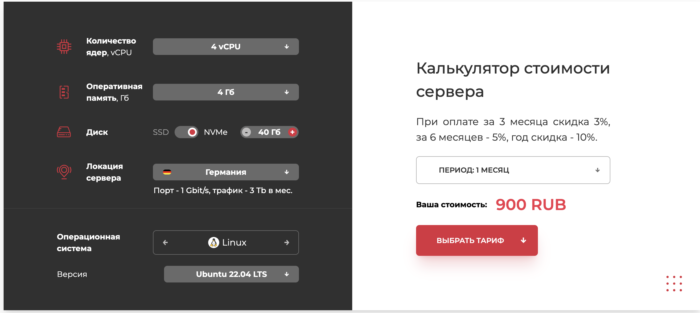
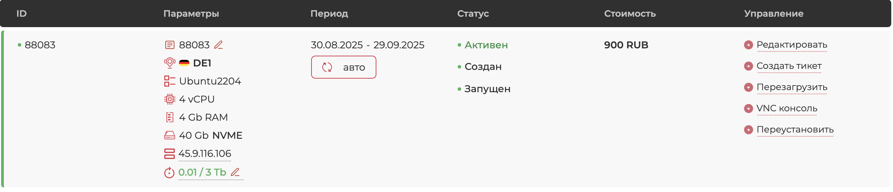

# 🛡️ Создание невидимого прокси-сервера на базе Xray и Reality

## 📖 Введение

Вы держите в руках не просто очередную инструкцию.
Это — исчерпывающее руководство, плод анализа десятков источников и практического опыта, цель которого — дать вам в руки инструмент для обеспечения цифровой свободы и конфиденциальности.

В эпоху, когда **интернет-провайдеры**, **корпорации** и **государственные органы** стремятся контролировать, анализировать и ограничивать ваш доступ к информации, стандартные решения, такие как коммерческие **VPN**, всё чаще дают сбой.
Их бизнес-модели и протоколы слишком стандартизированы, что делает их лёгкой мишенью для современных систем блокировок.

Мы пойдём другим путём.
Этот документ научит вас с нуля создавать свой собственный, персональный прокси-сервер.
Он будет принадлежать только вам, и только вы будете знать, как он устроен.

Мы будем использовать передовой стек технологий (**Xray**, **VLESS**, **Reality**), которые на сегодняшний день являются золотым стандартом для маскировки трафика.
В качестве опционального, но крайне рекомендованного шага, мы также рассмотрим настройку собственного **DNS-сервера** для полной приватизации трафика и блокировки рекламы на всех устройствах.

В результате наших действий ваш трафик станет неотличим от обычного, зашифрованного **HTTPS**-соединения с крупным мировым сайтом (например, **Microsoft** или **Google**), что делает его обнаружение и блокировку практически невозможными.

!!! abstract "Кому предназначено это руководство"

    *   **Новичкам:** Каждый шаг расписан с максимальной детализацией.
    Вам не нужны предварительные знания в администрировании **Linux**.
    Я объясню каждую команду.
    *   **Опытным пользователям:** Вы найдете здесь структурированную информацию, лучшие практики и объяснение тонкостей работы протокола **Reality**, что позволит вам глубже понять технологию и, возможно, оптимизировать вашу текущую конфигурацию.

!!! success "Философия нашего подхода"

    1.  **Максимальная Скрытность:** Наш главный приоритет — не просто шифрование, а мимикрия.
    Мы не прячемся, а сливаемся с толпой.
    2.  **Полный Контроль:** Это ваш сервер.
    Никаких логов, никаких ограничений по скорости (кроме возможностей сервера), никаких сторонних компаний, анализирующих ваши данные.
    3.  **Эффективность:** Мы настроим «умную» маршрутизацию.
    Российские сервисы будут работать напрямую, с минимальной задержкой.
    Зарубежные — через наш защищённый туннель.
    Это быстро, удобно и экономит ресурсы.

Приготовьтесь.
Путь будет не самым коротким, но результат того стоит.

---

## 🔬 Погружение в теорию

Прежде чем мы напишем первую команду в терминале, жизненно важно понять, *что*, *как* и *почему* мы делаем.
Этот раздел — фундамент, на котором будет строиться вся наша дальнейшая работа.

### 📡 Система DPI

Чтобы победить врага, нужно знать его в лицо.
В нашем случае враг — это технология **DPI (Deep Packet Inspection)**, или «глубокий анализ пакетов».

Представьте себе почтовый сортировочный центр.

Обычный маршрутизатор смотрит только на «конверт» вашего пакета данных: **IP-адрес** отправителя и получателя.
Ему всё равно, что внутри.

Система **DPI** — это дотошный и подозрительный таможенник на этом почтовом узле.
Она не просто смотрит на адреса, а вскрывает каждый конверт (пакет) и анализирует его содержимое.

!!! question "На что смотрит DPI?"

    1.  **Сигнатуры протоколов:** У многих протоколов, включая классические **VPN** (**OpenVPN**, **IKEv2**, **WireGuard**), есть уникальные «отпечатки пальцев» — определённые последовательности байт, структура «рукопожатия» (**handshake**), стандартные порты.
    **DPI** имеет картотеку этих отпечатков и, обнаружив совпадение, бьёт тревогу.
    2.  **Метаданные TLS/SSL:** При установке защищённого **HTTPS**-соединения ваш браузер и сервер обмениваются сертификатами.
    **DPI** анализирует этот обмен.
    Если вы используете самоподписанный сертификат (что часто бывает при настройке своего **VPN** «в лоб») или параметры шифрования (**Cipher Suites**) выглядят нестандартно, система помечает такой трафик как подозрительный.
    3.  **Поведенческий анализ:** **DPI** может анализировать не только отдельные пакеты, но и всю сессию целиком.
    Длительность соединения, объём переданных данных, соотношение входящего и исходящего трафика — всё это может выдать туннель.

!!! warning "Активное пробивание (Active Probing)"

    Это следующий, более агрессивный этап.

    Если **DPI** заподозрил, что по какому-то адресу находится «серый» прокси-сервер, он может отправить на него специально сформированный «тестовый» запрос, характерный для того или иного протокола.
    Если сервер отвечает так, как от него ожидает «шпионский» клиент, он раскрывает себя и немедленно попадает в бан-лист.

!!! note "Вывод"

    Чтобы быть невидимым, наш сервер должен не только шифровать трафик, но и на уровне протокола и поведения идеально имитировать обычный, ничем не примечательный легитимный веб-сервер.

    Но как этого достичь? Давайте рассмотрим эволюцию технологий обхода блокировок, чтобы понять, почему наш выбор пал именно на **VLESS** + **Reality**.

### ⚔️ Эволюция борьбы

1.  **Первое поколение: Классические VPN (OpenVPN, WireGuard)**

    *   **Идея:** Создать зашифрованный туннель между пользователем и сервером.
    *   **Уязвимость:** Эти протоколы имеют уникальный и хорошо известный «почерк» (сигнатуру).
    Их «рукопожатие» при установке соединения легко распознается системами **DPI**.
    Это все равно что пытаться смешаться с толпой, будучи одетым в яркую, узнаваемую униформу.
    Их легко обнаружить и заблокировать.

2.  **Второе поколение: Прокси с маскировкой (Shadowsocks)**

    *   **Идея:** Отказаться от сложной структуры **VPN** и просто маскировать трафик, чтобы он был не похож на известный протокол.
    *   **Уязвимость:** Трафик хоть и зашифрован, но все еще выглядит «необычно».
    Он не похож ни на один стандартный веб-протокол.
    Продвинутые **DPI** могут использовать статистический анализ (анализ размеров и частоты пакетов) и активное пробивание, чтобы выявить такие серверы.

3.  **Третье поколение: Маскировка под HTTPS (V2Ray/Xray + TLS)**

    *   **Идея:** Гениальный шаг — «завернуть» трафик нашего прокси в стандартное **TLS (HTTPS)** соединение.
    Для внешнего наблюдателя это выглядит так, будто вы просто зашли на защищенный сайт.
    *   **Уязвимость (Проблема сертификата):** Чтобы это работало, вам нужен домен и **TLS-сертификат**.
    Если сертификат самоподписанный — это мгновенный «красный флаг» для **DPI**.
    Если вы используете настоящий сертификат (например, от **Let's Encrypt**) для своего малоизвестного домена (`my-secret-proxy.com`), это тоже подозрительно.
    Почему на этот никому не известный сайт идет так много трафика? Сервер становится целью для блокировки.

4.  **Четвертое поколение: Совершенная мимикрия (VLESS + Reality)**

    *   **Идея:** Решить проблему сертификата раз и навсегда.
    Вместо того чтобы использовать *свой* домен и сертификат, мы «одалживаем» криптографическую личность у реального, гигантского, доверенного сайта (`microsoft.com`, `google.com` и т.д.).
    *   **Неуязвимость:** Технология **Reality** показывает системе **DPI** *настоящий* сертификат от `microsoft.com`.
    **DPI** видит абсолютно легитимное **TLS-рукопожатие** с одним из самых доверенных сайтов в мире.
    Придраться не к чему.
    Активное пробивание также бесполезно — любой «неправильный» запрос просто перенаправляется на реальный сайт **Microsoft**.

5.  **Финальный штрих: Приватный DNS**

    *   **Идея:** Когда наш туннель стал абсолютно невидимым, последней уязвимостью остаются **DNS-запросы**.
    Решив и эту проблему с помощью собственного **DNS-сервера**, мы получаем ультимативное решение.

Именно этот путь эволюции и привел нас к нашему итоговому стеку. Но есть ли что-то дальше?

!!! note "Предел анонимности: Сеть Tor"

    *   **Идея:** Для достижения максимальной анонимности, когда нужно скрыть не только содержимое трафика, но и сам факт того, что разные действия совершаются одним человеком, существует сеть **Tor**.
    Трафик в ней проходит через цепочку из трех случайных серверов, что делает отслеживание практически невозможным.
    *   **Проблема:** Использование **Tor** — это следующий, гораздо более сложный уровень.
    Он значительно медленнее, а главное — **большинство хостинг-провайдеров (включая упомянутые в этом руководстве) прямо запрещают размещение узлов сети Tor** на своих серверах.

Поэтому, в рамках данного руководства, мы останавливаемся на самом продвинутом, быстром и разрешенном хостерами решении:

- **Xray** как платформа.
- **VLESS** как эффективный протокол.
- **Reality** как совершенная маскировка.
- **собственный DNS** как гарантия полной приватности.

### 🛠️ Разбор стека

#### 🧠 Xray-core

Представьте себе конструктор **LEGO** для создания сетевых туннелей.
Это и есть **Xray**.

Это не просто программа, а целая платформа (фреймворк), которая предоставляет строительные блоки для маршрутизации трафика.

!!! info "История и архитектура"

    *   **История:** **Xray** — это **форк** (ответвление) знаменитого проекта **V2Ray**, созданный его же ведущим разработчиком для более быстрого внедрения новых идей.
    На сегодняшний день **Xray** развивается активнее и предлагает самые передовые функции, включая **XTLS** и **Reality**.
    *   **Архитектура:** Ключевые понятия в **Xray** — это «входящие» (`` `inbounds` ``) и «исходящие» (`` `outbounds` ``) соединения.

        *   `` `inbound` ``: Это «порт», который слушает подключения от вас (от вашего клиентского приложения).
        Здесь мы настраиваем протокол (**VLESS**), порт и параметры безопасности (**Reality**).
        *   `` `outbound` ``: Это то, куда **Xray** отправляет ваш трафик после того, как принял и обработал его.
        Обычно это `` `freedom` `` (т.е. просто в интернет) или `` `blackhole` `` (в никуда, для блокировки рекламы).
        *   `` `routing` ``: Мозг системы, который решает, какой трафик с какого `` `inbound` `` на какой `` `outbound` `` направить.

#### 🚀 VLESS

**VLESS** — это протокол передачи данных.
Если **Xray** — это конструктор, то **VLESS** — это один из самых быстрых и эффективных «кубиков» в нём.

Его ключевые отличия от предшественника (**VMess**):

*   **Производительность:** **VLESS** значительно проще и не содержит избыточного кода, что положительно сказывается на скорости и нагрузке на процессор сервера.
Его «безгражданская» (**stateless**) природа также упрощает обработку соединений.
*   **Отсутствие собственного шифрования:** **VLESS** изначально спроектирован так, чтобы не заниматься шифрованием самостоятельно.
Он делегирует эту задачу нижележащему транспортному протоколу.
Это делает его гибким и позволяет использовать самые современные и надёжные методы шифрования, предоставляемые **TLS**.

#### 🎭 XTLS-Reality

Это самая важная и гениальная часть нашей системы.

**Reality** решает главную проблему всех самодельных прокси: проблему аутентификации и **TLS-сертификата**.

!!! example "Как это работает (по шагам)"

    1.  **Подготовка:** На сервере мы генерируем пару ключей (публичный и приватный) и выбираем реальный, крупный сайт для маскировки, например, `www.google.com`.
    2.  **Подключение клиента:** Ваше клиентское приложение, зная публичный ключ сервера и целевой сайт (`www.google.com`), инициирует стандартное **TLS**-соединение (**ClientHello**) так, как будто оно хочет подключиться к `www.google.com`.
    3.  **Магия на сервере:** Наш **Xray**-сервер принимает этот пакет.
    Он видит, что клиент хочет соединиться с `www.google.com`.
    Используя технологию **Reality**, он **проксирует, то есть пересылает этот запрос настоящему серверу Google**.
    4.  **Ответ от Google:** Сервер **Google**, ничего не подозревая, отвечает стандартным **TLS**-пакетом (**ServerHello**), присылая свой настоящий, валидный сертификат.
    5.  **Аутентификация и подмена:** Наш сервер получает этот ответ от **Google**.
    В этот момент он проверяет, совпадает ли публичный ключ, предоставленный клиентом в самом начале, с тем, что хранится у него.
    Если да — значит, это «свой» клиент.
    Сервер «вклинивается» в соединение.
    Для внешнего наблюдателя (**DPI**) вся сессия выглядит как абсолютно легитимный обмен данными с **Google**.
    **DPI** видит настоящий сертификат **Google**, стандартное рукопожатие.
    У него нет ни единой причины для подозрений.
    6.  **Создание туннеля:** После успешной аутентификации **Xray** перестаёт проксировать данные на **Google** и устанавливает прямой, зашифрованный туннель между клиентом и сервером, используя протокол **VLESS**.

!!! success "Итог"

    **Reality** решает проблему «палева».

    Нам не нужно покупать домен, нам не нужно возиться с получением и обновлением **TLS**-сертификатов.

    Мы «одалживаем» криптографическую идентичность у гигантов интернета, и это делает нас невидимыми.

### 🔒 DNS

Создав зашифрованный туннель, мы скрыли *содержимое* нашего трафика и его *конечный пункт назначения*.
Но остаётся один вектор для наблюдения — **DNS-запросы**.

!!! question "Что такое DNS?"

    **DNS (Domain Name System)** — это, по сути, «телефонная книга» интернета.

    Когда вы вводите в браузере `google.com`, ваш компьютер обращается к **DNS-серверу**, чтобы узнать **IP-адрес** этого домена (например, `142.250.186.78`).

    Без этого ваш браузер просто не знает, куда отправлять запрос.

!!! warning "Проблема стандартного DNS"

    По умолчанию, ваши **DNS-запросы** обрабатываются вашим интернет-провайдером.

    Даже если вы используете публичные **DNS-серверы** (например, `8.8.8.8` от **Google** или `1.1.1.1` от **Cloudflare**), владелец этого **DNS-сервера** видит полный список сайтов, которые вы посещаете.

    Создав наш прокси, мы шифруем основной трафик, но если **DNS-запросы** по-прежнему уходят к стороннему провайдеру, это оставляет «лазейку» для наблюдения.

    Это называется **утечкой DNS (DNS Leak)**.

!!! success "Решение: свой DNS-сервер"

    Разместив на нашем же **VPS** собственный **DNS-резолвер** (например, **Pi-hole** или **AdGuard Home**), мы получаем полный контроль над этим процессом.

    1.  **Приватность:** Все **DNS-запросы** отправляются по нашему же зашифрованному туннелю на наш собственный сервер.
    Никто со стороны не видит, какие сайты вы запрашиваете.
    2.  **Блокировка рекламы и трекеров:** Такие программы, как **Pi-hole**, позволяют вести «чёрные списки» доменов, связанных с рекламой, аналитикой и вредоносным ПО.
    Ваш **DNS-сервер** просто не будет на них отвечать, вырезая рекламу на уровне сети для всех ваших устройств.

    Таким образом, связка **Xray + собственный DNS** превращает ваш **VPS** в ультимативный инструмент для контроля над своим трафиком.

---

## ✈️ Подготовка

Прежде чем ринуться в бой, хороший полководец готовит армию и изучает поле битвы.

В нашем случае — это подготовка необходимых инструментов и осознанный выбор серверных компонентов.

Пропуск этого этапа — верный путь к проблемам в будущем.

### 🎒 Что понадобится

1.  **Адрес электронной почты:** Это должен быть надёжный, безопасный ящик, не связанный с вашими основными личными данными или с российскими сервисами.
**Proton Mail** или **Tutanota** — отличные варианты.
Они находятся в юрисдикциях с сильными законами о приватности (Швейцария и Германия) и используют сквозное шифрование.
2.  **Способ оплаты:** Вам понадобится способ оплаты услуг зарубежного хостинг-провайдера.
Многие до сих пор принимают карты **UnionPay**, выпущенные в РФ, или предлагают оплату через **криптовалюту**.
Изучите этот вопрос на сайте выбранного хостера.
3.  **Терминальный клиент:** Это программа для подключения к вашему серверу.
    *   **Windows:** Настоятельно рекомендую установить `` `Windows Terminal` `` из **Microsoft Store**.
    Это современный, удобный терминал с вкладками.
    Внутри него вы будете использовать встроенный клиент **OpenSSH**.
    Забудьте про старый `` `cmd.exe` ``.
    Как альтернатива для тех, кто привык, — **PuTTY**.
    *   **macOS/Linux:** У вас уже есть встроенный терминал.
    Просто найдите его (`` `Terminal.app` `` на **macOS**) — он более чем готов к работе.
4.  **(Опционально, но крайне рекомендуется) Доменное имя:** Хотя технология **Reality** избавляет нас от необходимости иметь домен для маскировки основного трафика, наличие собственного домена может быть полезно для других целей: например, чтобы настроить защищённый доступ по **HTTPS** к вашей панели управления **3x-ui**, а не заходить на неё по голому **IP-адресу**.
Домен можно дёшево зарегистрировать у зарубежных регистраторов.

### ☁️ Выбор VPS-провайдера

Выбор хостера — одно из самых ответственных решений.
От него зависят скорость, стабильность и безопасность вашего сервиса.

*   **VDSka:** Часто рекомендуется, поскольку исторически лоялен к клиентам из РФ и предлагает удобные способы оплаты.
Имеет хорошую репутацию в плане производительности.
*   **Vultr / DigitalOcean / Linode:** Это «большая тройка» мировых лидеров **VPS**-хостинга.
Они предлагают высочайшее качество сети, отличную производительность и панели управления.
Оплата может быть сложнее, но если у вас есть возможность — это прекрасный выбор.
*   **Hetzner:** Немецкий гигант, известный своими мощными и недорогими серверами.
Качество сети превосходное.

!!! abstract "Критерии выбора"

    *   **Локация серверов:** Нам нужна Европа.
    *   **Трафик:** Убедитесь, что в тариф включён достаточный объём трафика (обычно от 1 ТБ и выше, чего более чем достаточно для личного использования).
    *   **Виртуализация:** Предпочтительна **KVM**.
    Это технология, которая обеспечивает лучшую изоляцию вашего сервера от «соседей».
    *   **Политика использования (ToS / Оферта):** **Это критически важный шаг.**
    Перед оплатой **обязательно** найдите и внимательно прочитайте "Условия предоставления услуг" (**Terms of Service**, **Public Offer**).
    Ищите пункты, запрещающие **"прокси" (proxy)**, **"VPN"**, **"туннелирование" (tunneling)**.
    Некоторые хостеры прямо запрещают их размещение.
    Как мы выяснили на практике, игнорирование этого шага может привести к быстрой блокировке аккаунта.

### 🌍 Выбор локации

От того, где физически расположен ваш сервер, напрямую зависит задержка (**ping**) и, как следствие, скорость вашего соединения.

Выбор правильной локации — это не просто выбор страны, а выбор стратегической точки в глобальной сети.

!!! success "Почему Франкфурт и Амстердам — лучший выбор?"

    С технической точки зрения, размещение сервера в ЦОДах **Франкфурта (Германия)** или **Амстердама (Нидерланды)** — одно из самых оптимальных решений.

    Причина в том, что в этих городах находятся крупнейшие в мире точки обмена трафиком (**Internet Exchange Points**, **IXP**):

    *   **DE-CIX** во Франкфурте.
    *   **AMS-IX** в Амстердаме.

    Представьте их как фундаментальные «перекрёстки» интернета, где соединяются сети тысяч провайдеров, технологических гигантов и контент-платформ.

    Размещая сервер здесь, вы получаете:

    1.  **Максимальную скорость:** Ваш трафик попадает на «автобан» практически мгновенно, без необходимости петлять по второстепенным дорогам.
    Это обеспечивает минимально возможную задержку и высочайшую скорость до ресурсов по всему миру.
    2.  **Высокую стабильность:** Прямое соединение с огромным количеством сетей гарантирует стабильность и надёжность.
    3.  **Низкую вероятность блокировок:** Эти хабы являются нейтральной инфраструктурой, построенной на принципах свободного обмена трафиком.
    Введение цензуры на таком уровне крайне маловероятно как по техническим, так и по политическим причинам.

!!! note "Финляндия (Хельсинки)"

    Хорошая альтернатива, особенно для пользователей из северо-западной части РФ.

    Географическая близость может обеспечить очень низкий **ping**, однако маршруты до остального мира могут быть не такими оптимальными, как из центральной Европы.

!!! tip "Как выбрать оптимальную локацию"

    Если сомневаетесь — берите **Франкфурт**.

    Это самый универсальный и беспроигрышный вариант, сердце европейского интернета.

### 💿 Выбор дистрибутива

Наш сервер будет работать под управлением **Linux**.
Самые популярные и подходящие для наших целей дистрибутивы — это **Ubuntu** и **Debian**.

*   **Debian:** Образец стабильности и консерватизма.
Пакеты в репозиториях не самые свежие, зато протестированы вдоль и поперёк.
Отличный выбор, если вы цените надёжность превыше всего.
*   **Ubuntu:** Основана на **Debian**, но развивается гораздо динамичнее.
Предлагает более свежее ПО и некоторые удобные «фишки» для пользователя.
Является самым популярным дистрибутивом для серверов в мире, а это значит — гигантское сообщество и тонны документации.

!!! success "Наш выбор"

    **Ubuntu 24.04 LTS**.

    *   **LTS (Long-Term Support):** Это версия с длительной поддержкой (5 лет).
    Нам не придётся думать об обновлении всей системы в ближайшие годы.
    *   **Свежесть и стабильность:** Она предлагает достаточно свежие версии системных компонентов, оставаясь при этом очень стабильной.
    *   **Популярность:** Любой вопрос, который у вас возникнет, скорее всего, уже был задан и решён кем-то в интернете.

---

## 🏰 Развёртывание

Теория позади, подготовка завершена.
Время приступать к развёртыванию.

На этом этапе мы арендуем сервер, впервые подключимся к нему и проведём базовые, но критически важные настройки безопасности.

### 💳 Аренда сервера



Зайдите на сайт выбранного вами хостинг-провайдера.
Процесс регистрации и заказа обычно интуитивно понятен:

1.  Создайте аккаунт, используя подготовленный email.
2.  Перейдите в раздел заказа **VPS/Cloud** серверов.
3.  Выберите локацию (например, **Frankfurt**).
4.  Выберите образ операционной системы: **Ubuntu 22.04/Ubuntu 24.04**.
5.  Выберите тарифный план. Здесь есть два подхода:
    *   **Только для прокси (Xray):** Если вы планируете использовать сервер только для прокси, хватит самого минимального тарифа: **1 CPU, 2 ГБ RAM, 20-25 ГБ SSD**.
    *   **Прокси + DNS-фильтрация (рекомендуется):** Если вы, следуя советам этого руководства, захотите запустить еще и блокировщик рекламы **Pi-hole**, для комфортной работы рекомендуется выбрать тариф чуть мощнее: **2 CPU, 4 ГБ RAM, 40-60 ГБ SSD**.
    Это даст вам запас по памяти для больших списков блокировки.
6.  Оплатите заказ.

Через несколько минут ваш сервер будет готов.
Хостер пришлёт вам на почту или покажет в панели управления **IP-адрес**, имя пользователя (`` `root` ``) и пароль.
**Сохраните эти данные в надёжном месте.**



### 🩺 Первый вход

Первое, что мы делаем — подключаемся к нашему новому серверу.

Откройте ваш терминал (`` `Windows Terminal` ``, `` `Terminal.app` ``) и введите команду, заменив `` `ВАШ_IP_АДРЕС` `` на тот, что выдал хостер:

```bash
ssh root@ВАШ_IP_АДРЕС
```

!!! question "Что происходит при выполнении этой команды?"

    *   `` `ssh` ``: Название программы-клиента **Secure Shell**.
    *   `` `root` ``: Имя пользователя, под которым мы подключаемся. `` `root` `` — это суперпользователь в **Linux**, у него есть права на всё.
    *   `@`: Разделитель.
    *   `` `ВАШ_IP_АДРЕС` ``: Адрес нашего сервера в интернете.

!!! note "Подтверждение подлинности хоста"

    При самом первом подключении терминал покажет вам сообщение вида:

    ```
    The authenticity of host '...' can't be established.
    ECDSA key fingerprint is SHA256:....
    Are you sure you want to continue connecting (yes/no/[fingerprint])?
    ```

    Это нормально. Ваш компьютер ещё не «знаком» с этим сервером и просит подтвердить, что вы доверяете ему. Смело пишите `` `yes` `` и нажимайте **Enter**.

!!! warning "Ввод пароля вслепую"

    При вводе пароля в терминале **Linux** вы не увидите ни символов, ни звёздочек.
    
    Это сделано для безопасности.
    Просто аккуратно введите пароль и нажмите **Enter**.

Если вы всё сделали правильно, вы увидите командную строку, которая может выглядеть так: `` `root@ubuntu:~#` ``. Поздравляю, вы внутри вашего сервера!

!!! danger "Критически важная проверка: IP на «чистоту»"

    Прежде чем вы потратите время на настройку, нужно убедиться, что вам выдали "чистый" **IP-адрес**, не находящийся в глобальных черных списках.
    Это убережет вас от множества проблем в будущем.

    1.  **Узнаем свой IP:**

        ```bash
        apt update && apt install -y curl
        curl ipinfo.io/ip ; echo
        ```

    2.  **Проверяем IP:** Скопируйте полученный **IP-адрес** и проверьте его на нескольких сервисах. Самый важный — **Spamhaus**.

        *   `https://check.spamhaus.org/`
        *   `https://www.whatismyip.com/blacklist-check/`
        *   `https://2ip.ru/spam/`

    **Как читать результаты:**

    *   **Все чисто (Not Listed):** Отлично, можно продолжать.
    *   **Блокировка из-за "Open Resolver":** Если вы уже установили **Pi-hole** и видите такую ошибку, значит, вы неверно настроили его порты, и они доступны всему интернету.
    Вернитесь к главе о **Pi-hole** и исправьте конфигурацию.
    *   **Блокировка всей сети провайдера (SBL/CSS):** Если вы видите, что в бан попала вся подсеть вашего хостера (как это было в нашем примере с **Aeza**), **это самая плохая ситуация**.
    Это означает, что проблема не в вас, а в хостере, который допускает у себя вредоносную активность.
    **Вы лично это исправить не сможете.**

    **Что делать, если IP в черном списке?**

    Немедленно пишите в техподдержку хостера с просьбой заменить **IP-адрес** на чистый.
    Если они отказываются или новый **IP** также оказывается "грязным", **лучше сразу сменить хостинг-провайдера**, пока вы не потратили много времени и денег.

### 🛡️ Безопасность

Сейчас наш сервер подобен дому с прочной дверью (`` `root` `` и пароль), но с окнами нараспашку. Работать постоянно под `` `root` `` — опасно. Одна неверная команда может разрушить всю систему. А парольная аутентификация уязвима для **брутфорс-атак** (автоматизированного подбора паролей). Давайте это исправим.

**1. Обновление системы:**

Первым делом приведём всё программное обеспечение в актуальное состояние.

```bash
apt update && apt upgrade -y
systemctl reboot
```

*   `` `apt update` ``: Скачивает свежие списки пакетов из репозиториев.
*   `` `apt upgrade -y` ``: Обновляет все установленные пакеты до последних версий. Флаг `` `-y` `` автоматически отвечает «yes» на все вопросы.
*   `` `systemctl reboot` ``: Перезагружает сервер.

**2. Создание пользователя для себя:**

Создадим нового пользователя с обычными правами и дадим ему ваше имя (или любой ник, например `` `oni` ``).

```bash
adduser oni
```

Система попросит вас дважды ввести новый пароль для этого пользователя.
**Придумайте сложный пароль.**

Затем предложит ввести дополнительную информацию (имя, телефон) — можете просто нажимать **Enter**, оставляя поля пустыми.

**3. Предоставление прав администратора:**

Теперь нам нужно дать нашему новому пользователю возможность выполнять команды от имени `` `root` ``, когда это необходимо.
Для этого мы добавим его в группу `` `sudo` ``.

```bash
usermod -aG sudo oni
```

*   `` `usermod` ``: Команда для модификации пользователя.
*   `` `-aG` ``: Ключи, означающие «добавить» (`` `-a` ``) в «дополнительные группы» (`` `-G` ``).
*   `` `sudo` ``: Название группы, членство в которой даёт право использовать команду `` `sudo` ``.
*   `` `oni` ``: Имя нашего пользователя.

!!! success "Ключевой этап: Настройка доступа по SSH-ключу"

    Пароли можно подобрать.
    **SSH-ключи** — практически невозможно.
    
    Это самый важный шаг в защите вашего сервера.
    
    Давайте разберем его подробно.

    **Что такое SSH-ключи?**

    Это пара криптографических файлов:

    *   **Приватный ключ** (`` `id_ed25519` ``): Ваш секрет.
    Он хранится только на вашем компьютере и никогда его не покидает.
    Это как ваш паспорт или отпечаток пальца — он доказывает, что вы — это вы.
    *   **Публичный ключ** (`` `id_ed25519.pub` ``): Ваш замок.
    Вы можете свободно копировать его и размещать на любых серверах, к которым хотите иметь доступ.
    Он не является секретным.

    Когда вы подключаетесь, сервер просит вас доказать, что вы владеете приватным ключом, соответствующим публичному "замку".
    Ваш компьютер выполняет криптографическую операцию, и если все сходится — сервер вас пускает, даже не спрашивая пароль.

    **1. Создание ключей на вашем локальном компьютере**

    Если у вас еще нет **SSH-ключей**, создайте их.
    Откройте терминал **на вашем компьютере** (не на сервере) и выполните команду.
    
    Мы будем использовать современный и безопасный алгоритм `ed25519`.

    ```bash
    ssh-keygen -t ed25519 -a 100 -f ~/.ssh/id_ed25519 -C "$(whoami)@$(hostname)-$(date -I)"
    ```

    *   На все вопросы просто нажимайте **Enter**.
    Это создаст ключ со стандартным именем в стандартной папке (`~/.ssh/`) без дополнительной парольной фразы.

    **2. Резервное копирование ключа — КРИТИЧЕСКИ ВАЖНО!**

    Ваш приватный ключ (файл `` `id_ed25519` `` в папке `` `~/.ssh/` ``) — это единственный способ попасть на сервер после того, как мы отключим вход по паролю.

    *   **Если вы его потеряете (смена компьютера, поломка диска), вы навсегда потеряете доступ к серверу.**
    *   **Что делать:** Сделайте резервную копию этого файла.
    Скопируйте его в надежное место: ваш менеджер паролей (**1Password**, **Bitwarden**), зашифрованную флешку, облачное хранилище с шифрованием.
    Отнеситесь к этому как к резервной копии паспорта.

    **3. Копирование публичного ключа на сервер**

    Теперь нужно положить наш публичный "замок" на сервер.
    Для этого есть элегантная команда.

    Выполните её **на вашем локальном компьютере**:

    ```bash
    ssh-copy-id oni@ВАШ_IP_АДРЕС
    ```

    Она попросит пароль от пользователя `` `devops` ``, который мы создали ранее.
    После ввода пароля, ваш публичный ключ будет автоматически добавлен в нужный файл на сервере (`` `~/.ssh/authorized_keys` ``).

!!! danger "Отключаем вход по паролю и для root"

    Теперь, когда у нас есть пользователь `` `oni` `` и настроен вход по ключу, мы можем наконец-то запретить вход по паролю и под именем `` `root` ``.
    Это значительно повысит безопасность.

    *   Подключитесь к серверу под новым пользователем: `` `ssh oni@ВАШ_IP_АДРЕС` ``.
    *   Откройте конфигурационный файл **SSH**-сервера с помощью текстового редактора `` `nano` ``:
        ```bash
        sudo nano /etc/ssh/sshd_config
        ```
    *   Найдите в этом файле следующие строки и приведите их к такому виду (раскомментируйте, убрав `` `#` ``, и измените значение):
        ```
        PermitRootLogin no
        PasswordAuthentication no
        PubkeyAuthentication yes
        ```
    *   Сохраните файл: нажмите `Ctrl+O`, затем `Enter`. Выйдите из редактора: `Ctrl+X`.
    *   **Перезапустите SSH-сервис, чтобы применить изменения:**
        ```bash
        sudo systemctl restart sshd
        ```

!!! danger "Критически важно!"

    Не закрывайте текущую сессию!
    
    Откройте **новый** терминал и попробуйте подключиться снова (`` `ssh oni@ВАШ_IP_АДРЕС` ``).
    Если всё прошло успешно (вас должно пустить без пароля), значит, вы всё сделали правильно.
    
    Теперь вход на ваш сервер возможен только с вашего компьютера по ключу.

**4. Настройка базового файрвола (`ufw`):**

Последний штрих в укреплении — настройка брандмауэра.
Мы будем использовать `` `ufw` `` (**Uncomplicated Firewall**), удобную оболочку для управления правилами файрвола в Linux.

!!! note "Проверка и установка UFW"

    Хотя `ufw` предустановлен в большинстве сборок Ubuntu, не лишним будет это проверить и, при необходимости, установить.

    ```bash
    # Устанавливаем ufw, если он отсутствует
    sudo apt update
    sudo apt install ufw -y
    ```

Теперь, когда `ufw` точно на месте, настроим его базовую логику — «запрещать всё, что не разрешено».
Это золотой стандарт безопасности.

```bash
# Запрещаем все входящие соединения по умолчанию
sudo ufw default deny incoming

# Разрешаем все исходящие соединения по умолчанию
sudo ufw default allow outgoing
```

После этого наш сервер станет «глухим» к любым запросам извне.
Теперь нам нужно аккуратно открыть нужные «двери», чтобы не потерять доступ.

```bash
# КРИТИЧЕСКИ ВАЖНО: Разрешаем подключения по SSH. 
# Если этого не сделать, после активации файрвола вы потеряете доступ к серверу!
# Если вы сменили стандартный порт SSH, укажите его вместо OpenSSH.
sudo ufw allow OpenSSH

# Разрешаем порт, который будем использовать для нашего прокси
sudo ufw allow 8443/tcp

# (Опционально) Если вы планируете использовать приложения, требующие UDP
# (например, звонки в Discord, онлайн-игры), откройте этот же порт и для UDP:
sudo ufw allow 8443/udp
```

**5. Контроль над IPv6 — закрываем «черный ход»**

!!! warning "Важный аспект безопасности"

    Многие хостеры по умолчанию выдают **IPv6-адрес**.
    Если `` `ufw` `` настроен на работу только с **IPv4**, все порты могут быть "открыты" через **IPv6**, сводя на нет всю защиту.
    
    Это классическая ошибка, которую необходимо исправить.

*   **Проверьте, есть ли у вас IPv6:**
    ```bash
    ip -6 addr
    ```

    Если в выводе есть `inet6` с `scope global` — у вас есть публичный **IPv6**, и следующий шаг обязателен.

*   **Включите поддержку IPv6 в ufw:**

    ```bash
    sudo nano /etc/default/ufw
    ```

    Найдите строку `IPV6=` и убедитесь, что она имеет значение `yes`:

    ```
    IPV6=yes
    ```

    Сохраните файл (`Ctrl+O`, `Enter`) и выйдите (`Ctrl+X`).

Теперь можно включать файрвол.

```bash
# Включаем файрвол
sudo ufw enable
```

На вопрос `` `Command may disrupt existing ssh connections. Proceed with operation (y|n)?` `` отвечайте `` `y` ``.

Проверим статус:

```bash
sudo ufw status verbose
```

Вы должны увидеть, что он активен и разрешает трафик на нужные порты.
Благодаря нашим правкам, правила будут действовать как для `(v4)`, так и для `(v6)`.

**6. Настройка Часового Пояса:**

Это небольшой, но важный шаг для корректного отображения времени в логах и системных сообщениях.

Установим, к примеру, центральноевропейское время.

```bash
sudo timedatectl set-timezone Europe/Berlin
```

Проверить можно командой `` `date` ``.

**7. Установка `Fail2Ban` — наш автоматический телохранитель:**

**Fail2Ban** — это сервис, который следит за логами и автоматически блокирует **IP-адреса**, с которых идут многократные неудачные попытки входа.

Это лучшая защита от автоматизированных атак (**брутфорса**).

```bash
# Устанавливаем Fail2Ban
sudo apt install -y fail2ban

# Сервис запускается и включается в автозагрузку автоматически.
# Проверим его статус:
sudo systemctl status fail2ban
```

!!! warning "Если Fail2Ban не запускается (ошибка)"

    В некоторых современных системах (например, Ubuntu 22.04/24.04) `fail2ban` может не запуститься сразу после установки.
    Если команда `sudo systemctl status fail2ban` показывает ошибку `Active: failed`, а в логах есть строка `Have not found any log file for sshd jail`, это значит, что сервис не может найти лог-файл SSH.

    Это происходит потому, что система использует централизованный журнал `systemd`, а `fail2ban` по умолчанию ищет старый файловый лог.

    **Решение (самый правильный способ):**

    1.  **Создайте локальный файл конфигурации `jail.local`:**

        ```bash
        sudo nano /etc/fail2ban/jail.local
        ```

    2.  **Вставьте в него две строки**, которые укажут `fail2ban` использовать `systemd` для отслеживания логов SSH:

        ```ini
        [sshd]
        backend = systemd
        ```

    3.  **Сохраните файл** (`Ctrl+O`, `Enter`) и **выйдите из редактора** (`Ctrl+X`).

    4.  **Перезапустите сервис:**

        ```bash
        sudo systemctl restart fail2ban
        ```

    5.  **Проверьте статус еще раз.**
    Теперь вы должны увидеть зелёную надпись `Active: active (running)`.

**Fail2Ban** по умолчанию уже содержит конфигурацию для защиты **SSH**.
Чтобы посмотреть, кто был заблокирован, можно использовать команду `` `sudo fail2ban-client status sshd` ``.

**8. Настройка автоматических обновлений безопасности (`unattended-upgrades`):**

Чтобы не заходить на сервер каждую неделю для установки обновлений, мы можем поручить это системе.
Пакет `` `unattended-upgrades` `` будет автоматически устанавливать самые важные, критические обновления безопасности.

```bash
# Устанавливаем пакет
sudo apt install -y unattended-upgrades

# Включаем его с помощью диалогового окна
sudo dpkg-reconfigure -plow unattended-upgrades
```
В появившемся псевдографическом окне выберите `<Yes>`, чтобы разрешить автоматическую установку.

!!! success "Крепость построена!"

    **Фух!** Этот этап был самым длинным и, возможно, сложным, но теперь ваш сервер — это настоящая маленькая крепость, которая к тому же будет сама о себе заботиться.
    
    Мы готовы к установке основного программного обеспечения.

---

## 🎯 Маскировка

Это один из самых важных шагов, от которого напрямую зависит стабильность и незаметность вашего туннеля.
Технология **Reality** работает, «притворяясь» другим, очень известным и популярным сайтом.

Если выбрать неправильный сайт, системы **DPI** могут заметить аномалии и заподозрить неладное.

### 🤔 Критерии

Не любой сайт подходит на роль «донора». Вот ключевые критерии:

1.  **Популярность и репутация:** Сайт должен принадлежать крупной, известной международной компании (**Microsoft**, **Google**, **Apple**, **Amazon**, **Cloudflare** и т.д.).
Трафик к таким сайтам огромен, и ваш маленький ручеёк в нём просто затеряется.
2.  **Современный TLS:** Сайт должен поддерживать современные версии протокола **TLS** (в идеале **TLS 1.3**) и использовать надёжные шифры.
Это гарантирует, что «рукопожатие» будет выглядеть стандартно для систем анализа трафика.
3.  **Хорошая сетевая связность:** Серверы сайта должны быть расположены на крупных **CDN** (**Content Delivery Network**) и иметь хорошую сетевую доступность с вашего **VPS**.
Это напрямую влияет на скорость и задержку вашего соединения.
4.  **Отсутствие блокироков:** Очевидно, что сайт не должен быть заблокирован или ограничен в вашей стране.

!!! warning "Не используйте сайты из примеров!"

    Не стоит всем использовать `www.microsoft.com` или `www.google.com`.
    Если тысячи пользователей будут использовать одни и те же сайты для маскировки, это может стать сигналом для систем блокировок.
    
    Ищите свой, уникальный вариант, проверяя его самостоятельно.

### 🕵️ Проверка кандидата

Вместо ненадёжных или устаревших сканеров мы воспользуемся мощным и известным в индустрии инструментом — **testssl.sh**.

Он проведёт детальную проверку TLS-конфигурации сайта и даст нам всю информацию для принятия решения.

**Шаг 1: Установка зависимостей и самого скрипта**

```bash
# Устанавливаем зависимости: git и утилиты для сети и DNS
sudo apt update
sudo apt install git bsdmainutils dnsutils -y

# Клонируем репозиторий со скриптом
git clone --depth 1 https://github.com/drwetter/testssl.sh.git
```

**Шаг 2: Использование**

Перейдите в созданную папку и запустите проверку для интересующего вас домена.

Рекомендую протестировать 3-4 сайта крупных IT-компаний, чтобы выбрать лучший для вашей локации.

```bash
# Переходим в папку со скриптом
cd testssl.sh/

# Запускаем проверку, например, для www.microsoft.com
./testssl.sh www.microsoft.com

# Можете проверить и другие, например:
# ./testssl.sh www.apple.com
# ./testssl.sh www.cloudflare.com
```

**Шаг 3: Анализ результатов**

Скрипт выведет очень много информации. Нас интересуют следующие ключевые моменты:

!!! abstract "На что обратить внимание в выводе testssl.sh"

    *   **Поддержка TLS 1.3:** Убедитесь, что в секции `TLS 1.3` стоит `offered (OK): final`.
    *   **Современные шифры:** В списке шифров для TLS 1.3 должны присутствовать надёжные варианты, такие как `TLS_AES_256_GCM_SHA384` или `TLS_CHACHA20_POLY1305_SHA256`.
    *   **Доверенный сертификат:** В секции `Chain of certificates` проверьте, что сертификат выдан известным центром (`Let's Encrypt`, `Google Trust Services`, `DigiCert` и т.д.) и у него не истёк срок действия.
    *   **Итоговая оценка:** В самом конце отчёта будет секция `Rating`.
    Итоговая оценка `Overall Grade` должна быть **`A+`**.

!!! success "Выбор победителя"

    Сайт, у которого все эти пункты в порядке, является отличным кандидатом.
    Выберите его и запишите доменное имя — оно понадобится нам на следующем шаге.

Теперь, вооружившись идеальным доменом для маскировки, мы можем переходить к настройке самого **Xray**.

---

## ⚙️ Установка Xray

Двигаемся дальше.
Сервер полностью готов и защищён.

Теперь переходим к самому интересному — установке и настройке программного обеспечения, которое и будет создавать наш невидимый туннель.

!!! info "Зачем нужна панель управления?"

    Мы будем использовать удобную панель управления **3x-ui**, которая предоставляет графический интерфейс для управления **Xray**.

    Это избавляет нас от необходимости вручную редактировать сложные файлы конфигурации в формате **JSON**, что значительно снижает порог входа и вероятность ошибки.

### 📥 Установка 3x-ui

Разработчики **3x-ui** предоставляют удобный скрипт для автоматической установки.

Он сам определит вашу систему, скачает необходимые файлы и настроит базовую конфигурацию.

Подключитесь к вашему серверу под пользователем `` `oni` `` и выполните следующую команду:

```bash
curl -Ls https://raw.githubusercontent.com/alireza0/x-ui/master/install.sh | sudo bash
```

!!! question "Что делает эта команда?"

    *   `` `curl -Ls ...` ``: Скачивает установочный скрипт с **GitHub**.
    *   `` `| sudo bash` ``: Передаёт скачанный скрипт напрямую в командный интерпретатор `` `bash` `` для выполнения, не сохраняя его на диске.

После завершения установки скрипт покажет вам информацию о том, как получить доступ к панели.

!!! success "Доступ к панели через SSH-туннель (Рекомендуется)"

    Из соображений безопасности, мы не будем открывать порт панели управления для всего интернета. Вместо этого мы будем получать к ней доступ через защищённый **SSH-туннель**. Это гарантирует, что никто, кроме вас, не сможет даже попытаться получить к ней доступ.

    Чтобы подключиться, откройте терминал **на вашем локальном компьютере** и выполните команду, которая «пробросит» порт панели на вашу машину:

    ```bash
    # Замените 2053 на порт вашей панели и укажите ваш IP и пользователя
    ssh -L 2053:127.0.0.1:2053 oni@ВАШ_IP_АДРЕС
    ```

    Пока этот терминал открыт, вы можете зайти в панель через браузер по адресу `http://127.0.0.1:2053`.

    !!! warning "О предупреждении 'This connection is not secure'"

        Когда вы зайдёте в панель, вы, скорее всего, увидите это предупреждение. **Не пугайтесь, ваше соединение в безопасности.**

        Панель `3x-ui` просто видит, что ваш браузер обращается к ней по протоколу `http://`, а не `https://`, и по умолчанию выводит предупреждение.

        Она не знает, что весь ваш трафик уже надёжно зашифрован **SSH-туннелем**. Поэтому это предупреждение в нашем случае можно смело игнорировать.

### ⚙️ Настройка Xray

Прежде чем создавать подключения для пользователей, давайте один раз настроим глобальные параметры самого ядра Xray для максимальной приватности и безопасности.

Все эти настройки находятся в разделе **"Настройки Xray"** (Xray Configs) в меню панели.

**Вкладка "Basics"**

Здесь собраны основные параметры работы Xray.

*   **Freedom Protocol Strategy:** Указывает, какой IP-адрес (IPv4 или IPv6) ваш сервер будет использовать для выхода в интернет.
    *   **Рекомендация:** Установите `UseIPv4`.
    Это самый надежный вариант, исключающий потенциальные проблемы с доступностью сайтов по IPv6.
*   **Log Level (Уровень логов):** Определяет подробность записей в логах.
    *   **Рекомендация:** Для обычной работы установите `Warning` (Предупреждение).
    Это оптимально, чтобы не засорять диск.
    Уровень `Info` или `Debug` включайте только для поиска неисправностей.
*   **Mask Address (Маскировать адрес):** Скрывает IP-адреса пользователей в логах. Опции означают:
    *   `Empty`: Маскирование отключено.
    *   `Quarter`/`Half`: Маскируется часть адреса.
    *   `Full`: Адрес маскируется полностью (например, заменяется на `0.0.0.0`).
    *   **Рекомендация:** Установите `Full` для максимальной приватности.
*   **Block BitTorrent Protocol:** Включает обнаружение и блокировку торрент-трафика.
    *   **Рекомендация:** **Обязательно включите**. Это защитит вас от блокировки сервера хостинг-провайдером.
*   **Остальные настройки** (`Family Protection`, `Block IPs/Domains` и т.д.) являются опциональными фильтрами, которые можно оставить без изменений.

**Вкладка "Routing"**

Здесь вы увидите три правила, созданных по умолчанию. Они важны для безопасности:

1.  **`api` -> `api`:** Служебное правило для работы самой панели. **Не трогайте его.**
2.  **`geoip:private` -> `blocked`:** Защитное правило, которое блокирует попытки доступа к внутренним сетям. **Оставьте его.**
3.  **`bittorrent` -> `blocked`:** Правило, которое физически реализует блокировку торрентов. **Оставьте его.**

**Вывод:** Вам **не нужно** добавлять сюда свои правила.
Всю интеллектуальную маршрутизацию (что пускать через VPN, а что — напрямую) мы будем делать на стороне клиентских приложений для максимальной эффективности.

**Вкладка "Outbounds"**

Здесь описаны два стандартных «выхода» для трафика **Их изменять не нужно.**:

1. `direct` (отправить в интернет как есть).
2. `blocked` (уничтожить). Они нужны для работы правил маршрутизации.

**Вкладки "Reverse" и "Balancers"**

Эти вкладки у вас будут пусты.

Они предназначены для очень сложных конфигураций с несколькими серверами и в нашем сценарии не используются.

**Вкладка "DNS"**

У нас будет собственный DNS на базе Pi-Hole, поэтому игнорируем данную вкладку.

### ⚙️ Настройка Панели

Теперь, когда ядро Xray настроено, давайте быстро пройдемся по настройкам самой веб-панели для удобства и максимальной безопасности.

Они находятся в разделе **"Настройки панели"** (Panel Settings) в меню.

**Основные настройки (General)**

*   **`Listen IP` (Слушаемый IP):** **Самая важная настройка безопасности.** Установите здесь `127.0.0.1`, чтобы запретить доступ к панели извне и сделать ее доступной только через ваш безопасный SSH-туннель.
*   **`Listen Port` (Слушаемый порт):** Порт, который был выдан при установке.
Вы можете его здесь изменить.
Главное — не забыть использовать актуальный порт в команде для SSH-туннеля.
*   **`Public/Private Key Path` (Пути к ключам):** Оставьте эти поля пустыми.
Мы используем SSH-туннель для шифрования, поэтому HTTPS для самой панели нам не нужен.
*   **`Session Duration` (Длительность сессии):** Время автоматического выхода из панели при бездействии.
Установите по своему усмотрению, например, `60` минут.
*   **`Time Zone` (Часовой пояс):** Установите свой часовой пояс, чтобы ежемесячный сброс трафика происходил в предсказуемое время.
*   **Остальные настройки** (`Remark Model`, `Listen Domain`, `URI Path`, `Pagination Size`, `Notifications`) для нашего сценария не являются критичными, и их можно оставить по умолчанию или проигнорировать.

**Настройки Telegram-бота (Telegram Bot)**

Эту вкладку мы на данном этапе **пропускаем**.

Она целиком относится к опциональной настройке уведомлений и бэкапов, которая описана в конце руководства.

**Настройки подписки (Subscription)**

Эту вкладку мы также **пропускаем**.
Эта функция предназначена для VPN-провайдеров, управляющих десятками серверов.

Для нашего личного сервера она не нужна и избыточна.
Мы будем добавлять конфигурацию на устройства более простым и прямым способом — через QR-код или ссылку.

### 🔗 Подключения

Это самая главная часть настройки.
Понимание всех опций очень полезно.

Давайте пройдемся по каждому параметру, который вы видите при создании или редактировании входящего подключения (Inbound).

Нас интересует раздел **"Входящие"** (`Inbounds`).

1.  Перейдите в раздел **"Входящие"** в меню слева.
2.  Нажмите зелёную кнопку **"+ Добавить входящее"**.

Перед вами откроется форма. Мы разделим её на несколько логических частей.

**Общие настройки подключения**

Это основные параметры, которые определяют, как работает данная группа подключений.

*   **`Enabled (on/off)` (Включено):**
    *   Простой переключатель. Позволяет временно выключить все подключения в этой группе, не удаляя их.

*   **`Remark` (Заметка/Имя):**
    *   Дружелюбное имя для этого набора настроек, которое будет отображаться в списке (например, `MyRealityLink`).

*   **`Protocol` (Протокол):**
    *   Основной протокол, который будет использоваться. Мы выбираем **VLESS** за его высокую производительность и идеальную совместимость с Reality.

*   **`Port` (Порт):**
    *   Порт, который будет "слушать" сервер для приема подключений от вас. Именно этот порт мы должны были ранее открыть в файрволе `ufw` (например, `8443`).

*   **`Listen IP` (Слушаемый IP):**
    *   IP-адрес, на котором сервер будет принимать подключения.
    *   **Рекомендация:** Оставьте это поле пустым. Это заставит Xray принимать подключения на всех доступных IP-адресах сервера, что является стандартным поведением для VPN.

*   **`Total Traffic` (Лимит трафика, ГБ):**
    *   Позволяет установить общий лимит трафика для всех пользователей этого подключения. `0` или пустое поле означает "безлимитно".

*   **`Expiration` (Срок действия):**
    *   Позволяет установить дату, после которой подключение перестанет работать. Пустое поле — "бессрочно".

*   **`Sniffing` (Анализ трафика):**
    *   Это очень важная функция, которую мы разберем подробно ниже. Пока что просто **включите** её.

**Настройки транспорта (Transmission)**

Эти настройки определяют, "во что будет завернут" ваш трафик VLESS для передачи по сети.

*   **`Transmission` (Транспорт):**
    *   `TCP (Raw)`: Стандартный вариант. Трафик идет напрямую через TCP-соединение. Это самый быстрый и простой способ. В связке с Reality именно TCP является рекомендуемым выбором, так как маскировку обеспечивает сама технология Reality на уровне TLS.
    *   `mKCP`: Транспорт на базе UDP, может быть быстрее в сетях с потерями пакетов (плохой мобильный интернет), но потребляет больше трафика.
    *   `Websocket`, `gRPC`, `HTTP/2`: Это транспорты, которые маскируют ваш трафик под обычный веб-трафик. Они полезны для обхода очень строгих корпоративных файрволов, но для Reality они избыточны и только добавят сложности и немного снизят скорость.

!!! success "Рекомендация"

    Для нашего руководства выбираем **`TCP`**.

!!! question "А как же UDP для Discord и игр?"

    Это один из самых важных практических вопросов.
    
    Выбор `TCP` в качестве транспорта **не ломает UDP**.
    Протокол VLESS умеет "упаковывать" UDP-пакеты от ваших приложений (Discord, игры) внутрь основного TCP-туннеля.
    
    Поддержка UDP на самом деле зависит от настройки `Flow` в параметрах конкретного пользователя, о чем мы поговорим ниже.

**Настройки безопасности (Security)**

Когда вы выбираете `Security: reality`, появляются следующие поля:

*   **`uTLS`:**
    *   **Что это:** Позволяет Xray идеально замаскировать свое подключение под конкретный браузер (Chrome, Firefox, Safari и т.д.). Это важный элемент маскировки.
    *   **Рекомендация:** Выберите любой популярный браузер, например, `chrome`.

*   **`Dest` (Назначение):**
    *   **Что это:** Адрес реального популярного сайта, под который мы маскируемся (например, `www.microsoft.com:443`). Xray будет обращаться к этому сайту, чтобы "одолжить" у него настоящий сертификат. Это должен быть тот домен, который вы выбрали и проверили в **Главе 5**.

*   **`SNI` (Server Name Indication):**
    *   **Что это:** Имя домена, которое Xray будет показывать внешнему миру при подключении.
    *   **Рекомендация:** Должно быть точно таким же, как и домен в поле `Dest`.

*   **`Private Key / Public Key` (Приватный / Публичный ключ):**
    *   **Что это:** Та самая пара ключей, которая является "секретом" между вашим клиентом и сервером. Сервер использует приватный ключ, чтобы убедиться, что подключается "свой" клиент, у которого есть соответствующий публичный ключ.
    *   **Действие:** Нажмите кнопку **"Сгенерировать ключи"**.

*   **`Short IDs`:**
    *   **Что это:** Короткие идентификаторы для ускорения проверки подключения. Позволяют серверу быстро отсеивать посторонний трафик, не проводя полную криптографическую проверку.
    *   **Действие:** Нажмите кнопку генерации несколько раз, чтобы создать 2-3 ID.

*   **`SpiderX`:**
    *   **Что это:** Продвинутая настройка, позволяющая указать, как именно Xray будет добираться до сайта в поле `Dest`.
    *   **Рекомендация:** Оставьте поле пустым.

**Глубокий разбор Sniffing**

!!! warning "Почему Sniffing нужно включать, хотя панель рекомендует обратное?"

    Вы правы, заметив, что панель по умолчанию советует держать `Sniffing` выключенным.
    Это перестраховка для самых простых сценариев, чтобы избежать редких проблем совместимости.

    Однако для **нашей задачи** (умная маршрутизация, блокировка торрентов, полная функциональность Reality) **включение Sniffing является обязательным**.
    Без него самые мощные функции Xray просто не будут работать.

Включив главный переключатель `Sniffing`, вы увидите несколько опций:

*   **`HTTP`, `TLS`, `QUIC` (on/off):**
    *   **Что это:** Разрешают Xray анализировать соответствующие типы трафика, чтобы "увидеть" реальный домен, к которому идет запрос.
    *   **Рекомендация:** Включите (`on`) **все три**. Это позволит серверу распознавать и правильно маршрутизировать подавляющее большинство интернет-трафика.

*   **`FAKEDNS` (on/off):**
    *   **Что это:** Относится к продвинутой функции Fake DNS, которую мы не используем.
    *   **Рекомендация:** Оставить выключенной (`off`).

*   **`Route Only` (Только для маршрутизации):**
    *   **Что это:** Опасная настройка. Если включена, Xray будет доверять домену, указанному клиентом, но подключаться к IP, который запросил клиент, что открывает лазейки для атак.
    *   **Рекомендация:** Всегда оставляйте эту опцию **выключенной (`off`)**.

*   **`Metadata Only` (Только метаданные):**
    *   **Что это:** Продвинутая опция, влияющая на производительность.
    *   **Рекомендация:** Оставьте значение по умолчанию, которое предлагает панель.

!!! success "Итоговая рекомендация по Sniffing"

    *   **Главный переключатель:** `on`
    *   **HTTP:** `on`
    *   **TLS:** `on`
    *   **QUIC:** `on`
    *   **FAKEDNS:** `off`
    *   **Route Only:** `off`
    *   **Metadata Only:** по умолчанию

---

**Настройка пользователя (Client)**

После настройки общего входящего подключения, вы добавляете в него одного или нескольких пользователей, нажав синюю кнопку **"+ Добавить пользователя"**.
У каждого пользователя свои параметры.

*   **`Enabled (on/off)` (Включен):**
    *   Позволяет включить или выключить конкретно этого пользователя.

*   **`Email` (Электронная почта):**
    *   **Что это:** Уникальное имя или метка для этого пользователя. Это не обязательно должен быть email, это может быть `My-Phone`, `Annas-Laptop` и т.д.
    *   **Рекомендация:** Задайте осмысленное имя, чтобы вы знали, какому устройству или человеку принадлежит это подключение.

*   **`ID (UUID)`:**
    *   **Что это:** Уникальный идентификатор пользователя. Фактически, это его главный пароль. Он генерируется автоматически, и его нужно держать в секрете.

*   **`Flow` (Поток):**
    *   **Что это:** Критически важная настройка, отвечающая за производительность и поддержку UDP.
        *   `None` (или пустое поле): Стандартный режим. Может быть чуть медленнее для TCP, но **полностью поддерживает UDP** (голосовые чаты, игры).
        *   `xtls-rprx-vision`: Режим максимальной производительности для TCP (сайты, видео).
        **Не поддерживает UDP**.
        *   `xtls-rprx-vision-udp443`: Гибридный режим. Быстрый TCP, но пропускает UDP-трафик только на порт 443 (для протокола QUIC/HTTP3).
        **Не подходит для Discord и игр**, которые используют случайные порты.

!!! abstract "Нюанс: TCP-производительность против UDP-совместимости"

    **Рекомендация:**
    Создайте **двух пользователей** (два UUID в одном входящем подключении):

    1.  **Основной (для скорости):** С `flow: xtls-rprx-vision`. Используйте его на большинстве устройств для повседневных задач (веб, видео).
    2.  **Игровой/Голосовой (для совместимости):** С `flow: None` (пустым полем). Переключайтесь на него в клиентском приложении только тогда, когда вам нужно зайти в Discord, поиграть в онлайн-игру или использовать другое приложение, требующее UDP.

*   **`Total Traffic` (Лимит трафика, ГБ):**
    *   Индивидуальный лимит трафика именно для этого пользователя. `0` — безлимитно.

*   **`Start on Initial Use` (Начать при первом использовании):**
    *   Если включена, то отсчет срока действия начнется не с момента создания пользователя, а с момента его первого подключения. Удобно, если вы создаете доступ для друга.

*   **`Expiration` (Срок действия, дни):**
    *   Индивидуальный срок действия в днях для этого пользователя. Оставьте пустым для бессрочного доступа.

После заполнения всех полей нажмите зелёную кнопку **"Добавить"**.


### 📲 Ссылка для клиента

Теперь нам нужно передать все эти сложные настройки нашему клиентскому приложению (на телефоне или компьютере).

Панель **3x-ui** делает это максимально просто.

1.  В списке входящих подключений найдите созданное вами `` `MyRealityLink` ``.
2.  Нажмите на иконку **QR-кода** в столбце «Действия».
3.  Появится окно с **QR-кодом** и ссылкой.
    *   **QR-код**: Вы можете отсканировать его прямо с экрана мобильным приложением (например, **v2rayNG** для **Android** или **FoXray** для **iOS**).
    *   **Ссылка**: Вы можете скопировать длинную ссылку (начинается с `` `vless://...` ``) и вставить её в клиент на вашем компьютере.

!!! abstract "Что содержит ссылка?"

    Эта ссылка содержит всю необходимую информацию: ваш **UUID**, адрес сервера, порт, параметры **Reality** и т.д.

---

## 🔐 Настройка Pi-hole

Данный шаг - опционален.

Вы настроили прокси — это уже огромный шаг к свободе и безопасности.

Теперь давайте сделаем его еще лучше, добавив собственный **DNS-сервер** с функцией блокировки рекламы и трекеров.
Это превратит ваш **VPS** в полноценный бастион приватности.

Мы будем использовать **Pi-hole** — популярное и мощное решение с открытым исходным кодом. А для простоты установки и управления мы запустим его в **Docker**.

!!! info "Почему Pi-hole и Docker?"
    *   **Pi-hole:** Невероятно эффективен для блокировки нежелательного контента на уровне всей сети. Имеет огромное сообщество и множество готовых списков блокировки.
    *   **Docker:** Позволяет запустить **Pi-hole** и его зависимости в изолированном контейнере. Это чисто, безопасно и не «замусоривает» основную систему. Управлять, обновлять и удалять приложения в **Docker** — одно удовольствие.

### 🐳 Docker

Мы не будем приводить здесь конкретные команды, так как они могут незначительно меняться, но опишем общую концепцию, по которой вы легко найдете актуальные инструкции.

1.  **Установка Docker и Docker Compose:** Сначала на ваш сервер нужно установить **Docker** и **Docker Compose**.
Это стандартная процедура, для которой есть официальные инструкции.

    ```bash
    # Примерные команды для установки Docker
    sudo apt update
    sudo apt install docker.io docker-compose -y
    sudo systemctl start docker
    sudo systemctl enable docker
    ```

2.  **Создание `docker-compose.yml`:** Вы создаете файл `` `docker-compose.yml` ``, в котором описываете сервис для **Pi-hole**.
Ключевые моменты в этом файле:
    *   `image: pihole/pihole:latest`: Используем официальный образ.
    *   `ports`: Пробрасываем порты. Самое важное — **порт 53 (TCP/UDP) для DNS** и порт для веб-интерфейса (например, `8080:80`).
    *   `volumes`: Создаем постоянные хранилища для конфигурации **Pi-hole** (`` `/etc/pihole` ``) и его **DNS-кэша** (`` `/etc/dnsmasq.d` ``).
    Это гарантирует, что ваши настройки и списки не пропадут после перезапуска контейнера.
    *   `environment`: Указываем пароль для веб-интерфейса (`WEBPASSWORD`) и ваш часовой пояс (`TZ`).

3.  **Запуск:** Команда `` `sudo docker-compose up -d` `` в папке с файлом запустит ваш **Pi-hole** в фоновом режиме.

4.  **Настройка файрвола:** Не забудьте открыть в `` `ufw` `` порты, которые вы выбрали для **DNS** и веб-интерфейса.

    ```bash
    # Разрешаем DNS (стандартный порт)
    sudo ufw allow 53/tcp
    sudo ufw allow 53/udp

    # Разрешаем доступ к веб-интерфейсу (пример для порта 8080)
    sudo ufw allow 8080/tcp
    ```

### 🔗 Интеграция Pi-hole

Это **самый важный шаг**, в котором многие ошибаются. **DNS** не заработает «автоматически». Вы должны явно приказать вашему клиентскому приложению (на телефоне или ПК) использовать ваш новый **DNS-сервер**.

1.  Зайдите в **настройки вашего V2Ray/Xray клиента** (например, **v2rayNG**, **FoXray**, **Nekoray**).
2.  Найдите раздел **«Настройки DNS»** (**DNS Settings**).
3.  В качестве основного (или единственного) **DNS-сервера** укажите **публичный IP-адрес вашего VPS**.

!!! success "Как это работает?"

    Когда **VPN** активен, клиентское приложение перехватывает все **DNS-запросы**.
    
    Увидев в настройках **IP-адрес** вашего сервера, оно отправляет эти запросы не куда-то в интернет, а **внутрь зашифрованного туннеля** на ваш сервер.
    
    На сервере запрос попадает на порт `53`, где его уже слушает **Pi-hole**. **Pi-hole** обрабатывает запрос (блокируя рекламу) и отдает ответ, который так же по туннелю возвращается вам.

**Поздравляю!** Теперь ваш интернет-трафик не только зашифрован и замаскирован, но и полностью очищен от рекламы и трекеров, а ваши **DNS-запросы** абсолютно приватны.

---

## 🚀 Маршрутизация

После того как наш туннель заработал, можно сделать его по-настоящему «умным».

Цель — заставить трафик ходить по самому быстрому и эффективному пути.

Это и есть финальный шаг к идеальной конфигурации.

### 🧠 Ключевая идея

Золотое правило звучит так: **Через VPN должен идти только тот трафик, который не может идти напрямую. Всё остальное — мимо VPN.**

Это означает, что мы хотим направлять в наш туннель только две категории сайтов:

1.  **Сайты, заблокированные в РФ:** Ресурсы, доступ к которым ограничен вашим провайдером.
2.  **Сайты, блокирующие РФ:** Ресурсы, которые из-за санкций или своей политики не открываются с российских **IP-адресов** (например, **ChatGPT**, **Gemini**, **Netflix** и др.).

Весь остальной трафик — и российский, и зарубежный, который доступен напрямую — должен идти мимо туннеля. Это обеспечивает минимальный пинг и максимальную скорость.

!!! question "Почему на клиенте, а не на сервере?"

    Настроить такую логику можно и на сервере, но **максимальной эффективности можно достичь, только настраивая маршрутизацию на стороне клиента** (в приложении **v2rayNG**, **Nekoray** и т.д.).

    Почему? Если правила настроены на сервере, трафик до обычного `yandex.ru` все равно сначала долетит до вашего **VPS** в Германии и только потом вернется в Россию.
    Настраивая правила на клиенте, вы приказываете приложению даже не отправлять такой трафик на **VPS**, а сразу открывать его напрямую.
    Это экономит ресурсы, трафик и, главное, ваше время.

### 🗺️ Собираем "карты"

Для «умной» маршрутизации нам нужны актуальные списки доменов и **IP-адресов**.

Они содержатся в двух файлах:

*   `` `geosite.dat` ``: База данных доменов, сгруппированных по категориям (тегам).
Например, `geosite:google` содержит все домены **Google**.
*   `` `geoip.dat` ``: База данных **IP-адресов**, сгруппированных по странам.
Например, `geoip:ru` содержит диапазоны **IP-адресов**, относящихся к РФ.

!!! tip "Где брать лучшие списки?"

    Вам не нужно собирать их вручную. Существуют готовые сборки, которые включают и стандартные международные списки, и актуальные списки для обхода блокировок в РФ.

!!! info "Рекомендованный источник списков"

    Для работы маршрутизации необходимы актуальные базы данных доменов (`geosite`) и IP-адресов (`geoip`). Самый надежный источник — официальные репозитории от команды V2Fly.
    
    Вам нужно скачать два файла:
    
    1.  **`dlc.dat` (Geosite):** База данных доменов. Скачайте файл `dlc.dat` из последнего релиза:
        👉 [**v2fly/domain-list-community/releases/latest**](https://github.com/v2fly/domain-list-community/releases/latest)

    2.  **`geoip.dat` (GeoIP):** База данных IP-адресов. Скачайте файл `geoip.dat` из последнего релиза:
        👉 [**v2fly/geoip/releases/latest**](https://github.com/v2fly/geoip/releases/latest)

    **Важно:** Файл `dlc.dat` — это новое название для `geosite.dat`. Скачайте оба файла из секции "Assets" на страницах релизов и поместите их в папку с вашим клиентским приложением.

    Для правил вместо `geosite:antifilter` вам нужно будет использовать другие теги, например, `geosite:category-ads-all` для блокировки рекламы.

Файлы `` `.dat` `` бинарные, их нельзя просто открыть в блокноте. Но вся их структура открыта.

!!! info "Источник знаний о тегах"

    Подробнее см. в репозитории 👉 [**v2fly/domain-list-community**](https://github.com/v2fly/domain-list-community).

1.  **Чтобы узнать, какие теги существуют**, откройте в этом репозитории папку `data`.
Каждое имя файла в этой папке — это и есть доступный тег. Например, файл `google` соответствует тегу `geosite:google`.
2.  **Чтобы посмотреть, что внутри тега**, просто нажмите на нужный файл. Вы увидите список доменов, которые в него входят.

В списках от `antifilter` есть специальный тег (обычно `geosite:antifilter` или `geosite:blocked`), который содержит домены, заблокированные в РФ.

### 🏆 Настройка роутинга

Теперь, вооружившись актуальными списками, настроим саму логику.

Поскольку у нас больше нет единого списка заблокированных сайтов от Antifilter, безопаснее изменить логику по умолчанию.

Раньше мы направляли в VPN только то, что заблокировано.
Теперь мы будем делать наоборот: **направлять напрямую только то, в чем мы уверены, а весь остальной трафик — безопасно отправлять через VPN.**

Это более надежный подход в текущих условиях. Правила в клиентах всегда применяются сверху вниз до первого совпадения.

**Пример конфигурации для большинства клиентов (Clash Verge, Nekoray, v2rayNG):**

1.  **Правило №1: Реклама -> в черную дыру**
    *   **Направление:** `block` (или `blackhole`)
    *   **Домены:** `geosite:category-ads-all`
    *   *Описание: Блокирует подавляющее большинство рекламы и трекеров.*

2.  **Правило №2: Российские ресурсы -> напрямую**
    *   **Направление:** `direct`
    *   **Домены:** `geosite:category-ru`
    *   *Описание: Направляет все запросы к российским сайтам и сервисам по самому быстрому, прямому пути.*

3.  **Правило №3: Локальная сеть -> напрямую**
    *   **Направление:** `direct`
    *   **IP-адреса:** `geoip:private`
    *   *Описание: Стандартное правило, которое запрещает отправлять в VPN трафик, предназначенный для вашей домашней сети (например, для доступа к принтеру или роутеру).*

4.  **Правило по умолчанию: Все остальное -> через VPN**
    *   **Направление:** `proxy` (или как называется ваш сервер)
    *   *Описание: Весь остальной, неопознанный трафик (включая все зарубежные сайты, как заблокированные, так и нет) будет безопасно направлен через ваш зашифрованный туннель.*

После такой настройки ваш **VPN** будет работать максимально эффективно и безопасно, гарантируя, что вы случайно не зайдете на заблокированный ресурс напрямую.

!!! tip "Изучите другие категории самостоятельно"

    Мы использовали только самые основные категории (`category-ads-all`, `category-ru`).
    
    В скачанном вами репозитории `domain-list-community/data` лежат сотни других списков для самых разных нужд:

    *   `category-social-media` (соцсети)
    *   `category-streaming` (стриминговые сервисы)
    *   Списки для конкретных сервисов (`google`, `telegram`, `twitter` и т.д.)

    Вы можете изучить их и добавить в свою конфигурацию более сложные правила.
    Например, добавить правило для `geosite:category-streaming` над правилом по умолчанию, чтобы направлять видеосервисы через VPN.

---

## 📱 Настройка клиента

Мы построили нашу неприступную крепость на сервере.
Теперь пора проложить из нее удобные и быстрые потайные ходы для всех наших устройств.

В этой главе мы разберем лучшие клиентские приложения для каждой популярной операционной системы и, что самое главное, научимся настраивать их на максимальную эффективность.

### ⭐️ Общие принципы

Перед тем как перейти к конкретным программам, давайте усвоим два фундаментальных принципа, которые применимы ко всем клиентам.

**1. Способы импорта конфигурации**

В предыдущих главах мы получили **QR-код** и длинную ссылку, начинающуюся с `` `vless://...` ``.

Это два способа добавить конфигурацию вашего сервера в клиент:

*   **QR-код:** Идеально для мобильных устройств.
Открываете код на экране компьютера, сканируете его камерой телефона из приложения — и все готово.
*   **Ссылка:** Удобно для настольных компьютеров.
Копируете ссылку в буфер обмена и вставляете ее в клиент (обычно через опцию "Импорт из буфера обмена").

**2. "Золотая Логика" Маршрутизации на Клиенте**

Как мы обсуждали ранее, для максимальной скорости и эффективности трафик нужно разделять.

Через **VPN** должно идти только то, что заблокировано, а все остальное — напрямую.
Эту логику нужно настроить именно в клиентском приложении.

**Практические шаги для всех клиентов:**

1.  **Скачайте актуальные "карты" маршрутизации:**
2.  **Замените файлы в папке клиента:**
    *   Найдите, где ваше клиентское приложение хранит эти файлы (обычно это папка, куда установлена программа), и замените их на свежескачанные.
3.  **Настройте правила роутинга в приложении:**

Теперь, вооружившись этими знаниями, рассмотрим лучшие приложения для каждой платформы.

### 🤖 Android: v2rayNG

**v2rayNG** — это, без преувеличения, золотой стандарт для **Android**. Мощный, стабильный и гибкий клиент.

!!! info "Скачать v2rayNG"

    *   Для устройств с сервисами Google 👉 [**Google Play**](https://play.google.com/store/apps/details?id=com.v2ray.ang).
    *   Рекомендованный вариант (без сервисов Google) 👉 [**Страница релизов на GitHub**](https://github.com/2dust/v2rayNG/releases).

*   **Настройка:**
    1.  **Импорт:** Нажмите на `+` в правом верхнем углу и выберите "Импорт из QR-кода" или "Импорт из буфера обмена".
    2.  **Активация:** После импорта вы увидите вашу конфигурацию в списке. Нажмите на нее, чтобы сделать активной (она подсветится), а затем нажмите на большую круглую кнопку с логотипом V внизу, чтобы запустить **VPN**.
    3.  **Проверка:** Нажмите "Тест соединения" (значок с тремя точками), чтобы убедиться, что все работает.
    4.  **Настройка маршрутизации:**
        *   Зайдите в боковое меню (три полоски слева) -> **Настройки**.
        *   Пролистайте вниз до **"Пользовательские правила"** и вставьте туда ваши домены для проксирования (например, `geosite:antifilter, geosite:openai`).
        *   Убедитесь, что **"Режим маршрутизации"** установлен в `Обход LAN и материкового Китая` (это хорошая база, которую мы дополняем своими правилами).
        *   Для обновления файлов `geoip` и `geosite` зайдите в меню **"GeoX-файлы"** и нажмите **"Обновить"**.

---

### 🍎 iOS: v2box

Поиск хорошего клиента для **iOS**, доступного в России — непростая задача.

Платные приложения часто невозможно купить, а бесплатные бывают нестабильны. **v2box** — приятное исключение.

!!! success "Рекомендация: v2box"
    !!! info "Скачать v2box"
        Доступно в 👉 [**App Store**](https://apps.apple.com/us/app/v2box-v2ray-client/id6446814620).
    *   **Почему он:**
        *   **Бесплатный и доступный:** Легко скачивается из российского **App Store**.
        *   **Поддержка Reality:** Полностью совместим со всей нашей серверной настройкой.
        *   **Простота:** Не перегружен лишними функциями. Основная задача — импортировать ключ и подключиться — выполняется в несколько нажатий.
        *   **Стабильность:** По отзывам пользователей, работает значительно стабильнее многих альтернатив.
*   **Настройка:**
    1.  Скачайте приложение из **App Store**.
    2.  На вкладке "Configs" нажмите `+` и выберите "Import from QR code" или "Import from clipboard".
    3.  Перейдите на вкладку "Home", выберите импортированную конфигурацию из списка и нажмите большую кнопку запуска.

!!! tip "Продвинутая альтернатива (для энтузиастов)"

    Иногда самые новые и мощные клиенты распространяются через **TestFlight** (система бета-тестирования **Apple**).
    
    sВы можете поискать на **GitHub** или в профильных сообществах по запросам "VLESS Reality iOS TestFlight".
    
    Так можно найти клиенты на базе новейшего ядра `sing-box`, которые часто превосходят по производительности аналоги из **App Store**.

### 🖥️ Настольные Системы

В отличие от универсального Clash Verge, можно использовать "классические" клиенты, которые заточены под свою операционную систему. Они часто проще в освоении.

**Windows: v2rayN**

Это, возможно, самый популярный и функциональный клиент для Windows.

!!! info "Скачать v2rayN"

    1.  Перейдите на страницу релизов: 👉 [**v2rayN-GitHub**](https://github.com/2dust/v2rayN/releases)
    2.  Найдите последний релиз и скачайте архив с названием `v2rayN-Core.zip`.
    3.  Распакуйте архив в удобную папку. Запустите `v2rayN.exe`.

*   **Настройка:**
    1.  **Импорт:** Скопируйте вашу `vless://` ссылку. Откройте v2rayN и просто нажмите `Ctrl+V`. Сервер автоматически добавится в список.
    2.  **Активация:** В системном трее (возле часов) найдите иконку v2rayN. Кликните правой кнопкой мыши. В меню "System Proxy" выберите "Set System Proxy", чтобы весь трафик пошел через клиент.
    3.  **Маршрутизация:** В главном окне программы зайдите в "Settings" -> "Routing Rules", чтобы настроить правила, которые мы обсуждали.

**macOS: v2rayTun**

Это простой и удобный клиент, который можно установить напрямую из магазина приложений.

!!! info "Скачать v2rayTun"

    *   Откройте **App Store** на вашем Mac и найдите в поиске **v2rayTun**.

*   **Настройка:**
    1.  **Импорт:** Скопируйте `vless://` ссылку. В приложении v2rayTun нажмите `+` и выберите импорт из буфера обмена ("Import from clipboard").
    2.  **Подключение:** Выберите добавленный сервер из списка и нажмите кнопку подключения.

---

## ✅ Финальная Проверка

Поздравляем! Вы прошли огромный путь: от выбора сервера до настройки сложной системы маршрутизации.

Остался последний, но очень важный шаг — убедиться, что все работает как швейцарские часы.

Нам нужно проверить, что "умная" маршрутизация правильно разделяет трафик, отправляя в туннель только то, что нужно.

#### 🧪 Чем тестировать?

Самый надежный способ — это не сторонние сайты, а **встроенные инструменты вашего клиентского приложения**.

Почти все современные клиенты имеют журнал соединений, который в реальном времени показывает, куда идет каждый запрос.

**Альтернативный метод (простой, но менее точный):**

Используйте сайты для проверки **IP-адреса**.

1.  Отключите **VPN** и зайдите на сайт для проверки IP (например, 2ip).
Вы увидите ваш **реальный IP-адрес** от провайдера.
2.  Включите **VPN**. Обновите страницу.
Вы должны увидеть **IP-адрес вашего VPS** в Германии/Нидерландах.
Это значит, что базовое соединение работает.
3.  Далее, заходя на сайты из списка ниже, вы можете периодически обновлять сайт проверки IP, чтобы увидеть, меняется ли **IP**.
Этот метод менее удобен, чем анализ логов, но тоже работает.

#### 📋 Что тестировать?

Теперь откройте ваш клиент (например, **v2RayTun** с вкладкой "Connections") и начинайте "путешествие" по сайтам.

**1. Российские ресурсы (ожидаемый результат: `DIRECT`)**

Эти сайты должны открываться напрямую, с вашего реального **IP-адреса**, обеспечивая минимальную задержку.

*   `yandex.ru` или `dzen.ru` — для проверки доступа к главному поисковику.
*   `gosuslugi.ru` — портал госуслуг, который должен работать максимально быстро.
*   `sberbank.ru` (или сайт вашего банка) — для проверки работы онлайн-банкинга.
*   `ozon.ru` или `wildberries.ru` — для проверки работы крупных интернет-магазинов.

➡️ **В логах клиента вы должны видеть, что соединения к этим доменам помечены как `DIRECT`.**

**2. Заблокированные в РФ ресурсы (ожидаемый результат: `PROXY`)**

Эти сайты должны открываться через ваш **VPS** в Европе.

*   `rutracker.org` — классический пример заблокированного ресурса.
*   `linkedin.com` — профессиональная социальная сеть.
*   `twitter.com` (ныне X) — популярная соцсеть.
*   `instagram.com` и `facebook.com` — продукты компании **Meta**.

➡️ **В логах клиента вы должны видеть, что соединения к этим доменам помечены как `PROXY` (или названием вашего профиля).**

**3. Зарубежные ресурсы, блокирующие РФ (ожидаемый результат: `PROXY`)**

Эти сайты также должны открываться через ваш **VPS**, так как они могут не работать с российских **IP**.

*   `chat.openai.com` — сервис **ChatGPT**.
*   `gemini.google.com` — нейросеть от **Google**.
*   `netflix.com` — даже если нет подписки, главная страница должна загрузиться.
*   `huggingface.co` — популярное сообщество для специалистов по ИИ.

➡️ **В логах клиента вы также должны видеть, что соединения к этим доменам помечены как `PROXY`.**

---

## 🎉 Заключение

Если все тесты прошли успешно, примите мои искренние поздравления.

Вы не просто арендовали **VPN**.
Вы с нуля построили собственную, персональную систему для обеспечения цифровой свободы и приватности.

Теперь вы полностью контролируете свой трафик, он надежно зашифрован и замаскирован от любых наблюдателей, очищен от рекламы и трекеров, а также интеллектуально маршрутизируется для максимальной скорости и удобства.

Мир технологий не стоит на месте.
Не забывайте периодически (раз в несколько месяцев) обновлять ваши клиентские приложения, само ядро **Xray** на сервере (через панель **3x-ui**) и, конечно же, файлы правил маршрутизации (`` `geoip.dat` `` и `` `geosite.dat` ``).

Вы овладели мощным инструментом. Пользуйтесь им с умом!